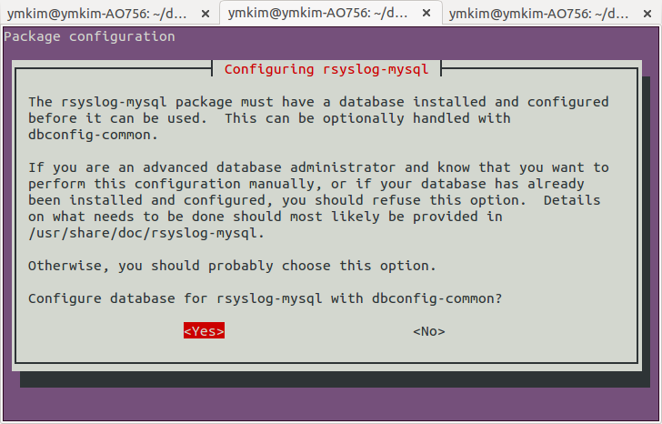
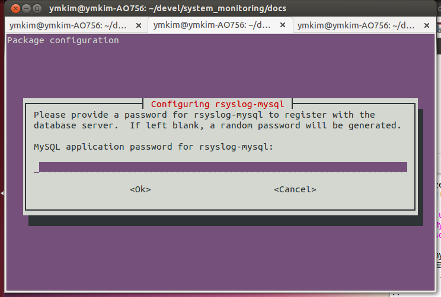
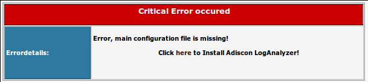
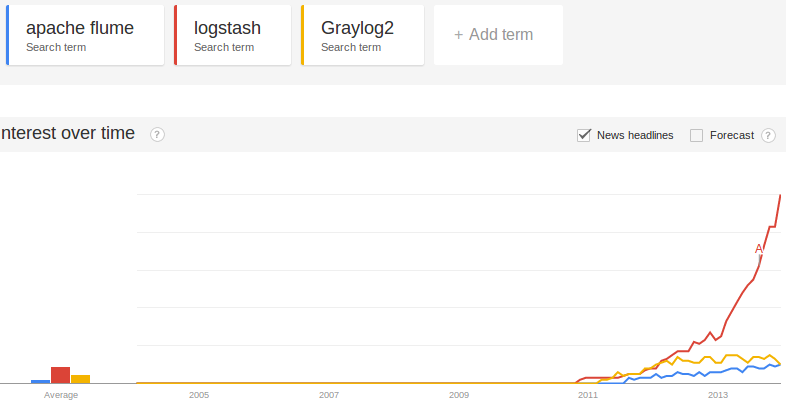

로그 (syslog)
-------------

모니터링 시스템에서 로그 보다 더 중요한 것이 있을까? 나는 없다고 생각한다.
자신만의 로그를 만들어 사용할 수도 있겠지만, 
사실상의 로그 표준으로 사용되고 있는 syslog 그 중에서도 ubuntu에서
기본으로 사용하는 rsyslog를 이용하여 로그를 출력하고자 한다.
편의상 rsyslog를 syslog로 부르도록 하고 꼭 rsyslog 로 구분하여
나타낼 필요가 있을 때만 rsyslog 를 사용할 것이다.

syslog를 이용하면, 원격시스템 내부에서는 물론이고 로그의 내용을
서버로 전송하여 화일이나 DB에 저장하여 볼 수 있다. 단순한 기능 같지만,
원격시스템 모니터링에 있어서 가장 중요한 기능 중 하나라고 할 수 있다.
빈번하게 변화하는 값들은 modbus 프로토콜을 이용하여 모니터링하고, 
중요한 이벤트나 디버깅 정보등은 syslog로 관리하면 편리하다.
syslog는 특정 이벤트가 발생하는 시점들을 관리할 수도 있고, 시스템에 문제가
발생했을 때 원인을 분석하는 디버깅 용도로도 매우 유용하다.

.. note:: syslog는 IETF의 `RFC 5424 <http://tools.ietf.org/html/rfc5424>`_ 로 등록되어 있다. RFC 5424에는 syslog 메시지를 인터넷 상으로 전달하는 방법을 기술한다.

syslog 출력의 예
^^^^^^^^^^^^^^^^

다음은 ``/var/log/syslog`` 의 내용 일부이다. syslog가 설치된 시스템에서는
기본적으로 이 화일에 시스템에서 발생하는 로그들을 출력한다. 

::

    Dec  5 10:52:25 ymkim-AO756 anacron[1058]: Job cron.daily terminated
    Dec  5 10:52:25 ymkim-AO756 anacron[1058]: Normal exit (1 job run)

    ^^^^^^^^^^^^^^^ ^^^^^^^^^^^ ^^^^^^^^^^^^^  ^^^^^^^^^^^^^^^^^^^^^^^^^
    DATE   TIME     hostname    process name   message (log content) 

위의 예에서 보인바와 같이 syslog의 출력은 날짜와 시간으로 시작한다. 
이후 호스트 이름과 프로세스 이름을 출력하며, 여기까지는 
syslog에서 자동으로 출력해 주는 부분이다. 콜론(:) 이후의 내용이 
로그를 찍는 이유를 설명하는 메시지 부분이다.

.. note:: apache와 같은 프로그램은 syslog의 기준을 따르지 않는 독자적인 로그를 별도의 로그 파일에 기록한다. ubuntu의 경우 ``/var/log/apache2/`` 아래에 access log과 error log를 별도로 저장한다.

log level
^^^^^^^^^
본격적으로 syslog를 설명하기 앞서서 기본적인 내용를 하나 공부하고
넘어가야 한다. 바로 메시지의 특성을 정의하는
facility와 severity에 대한 내용이다.
facility는 메시지를 발생시킨 프로그램의 타입을 나타내는 값이며,
severity는 메시지의 성격 또는 중요도를 나타낸다.
syslog에서는 이 값에 따라 로그 메시지를 어느 화일에 기록할지,
누구에게 이 사실을 알릴 것인지를 결정한다.

- facility : auth, authpriv, daemon, cron, ftp, lpr, kern, mail, news, syslog, user, uucp, local0, ... , local7  

+-----------------+----------+--------------+------------------------------------------+
| Facility Number | Keyword  | C code       | Facility Description                     |
+=================+==========+==============+==========================================+
| 0               | kern     | LOG_KERN     | kernel messages                          |
+-----------------+----------+--------------+------------------------------------------+
| 1               | user     | LOG_USER     | user-level messages                      |
+-----------------+----------+--------------+------------------------------------------+
| 2               | mail     | LOG_MAIL     | mail system                              |
+-----------------+----------+--------------+------------------------------------------+
| 3               | daemon   | LOG_DAEMON   | system daemons                           |
+-----------------+----------+--------------+------------------------------------------+
| 4               | auth     | LOG_AUTH     | security/authorization messages          |
+-----------------+----------+--------------+------------------------------------------+
| 5               | syslog   | LOG_SYSLOG   | messages generated internally by syslogd |
+-----------------+----------+--------------+------------------------------------------+
| 6               | lpr      | LOG_LPR      | line printer subsystem                   |
+-----------------+----------+--------------+------------------------------------------+
| 7               | news     | LOG_NEWS     | network news subsystem                   |
+-----------------+----------+--------------+------------------------------------------+
| 8               | uucp     | LOG_UUCP     | UUCP subsystem                           |
+-----------------+----------+--------------+------------------------------------------+
| 9               | clock    | LOG_CRON     | clock daemon                             |
+-----------------+----------+--------------+------------------------------------------+
| 10              | authpriv | LOG_AUTHPRIV | security/authorization messages          |
+-----------------+----------+--------------+------------------------------------------+
| 11              | ftp      | .            | FTP daemon                               |
+-----------------+----------+--------------+------------------------------------------+
| 12              | .        | .            | NTP subsystem                            |
+-----------------+----------+--------------+------------------------------------------+
| 13              | .        | .            | log audit                                |
+-----------------+----------+--------------+------------------------------------------+
| 14              | .        | .            | log alert                                |
+-----------------+----------+--------------+------------------------------------------+
| 15              | cron     | .            | clock daemon                             |
+-----------------+----------+--------------+------------------------------------------+
| 16              | local0   | LOG_LOCAL0   | local use 0 (local0)                     |
+-----------------+----------+--------------+------------------------------------------+
| 17              | local1   | LOG_LOCAL1   | local use 1 (local1)                     |
+-----------------+----------+--------------+------------------------------------------+
| 18              | local2   | LOG_LOCAL2   | local use 2 (local2)                     |
+-----------------+----------+--------------+------------------------------------------+
| 19              | local3   | LOG_LOCAL3   | local use 3 (local3)                     |
+-----------------+----------+--------------+------------------------------------------+
| 20              | local4   | LOG_LOCAL4   | local use 4 (local4)                     |
+-----------------+----------+--------------+------------------------------------------+
| 21              | local5   | LOG_LOCAL5   | local use 5 (local5)                     |
+-----------------+----------+--------------+------------------------------------------+
| 22              | local6   | LOG_LOCAL6   | local use 6 (local6)                     |
+-----------------+----------+--------------+------------------------------------------+
| 23              | local7   | LOG_LOCAL7   | local use 7 (local7)                     |
+-----------------+----------+--------------+------------------------------------------+

- severity : Emergency, Alert, Critical, Error, Warning, Notice, Info or Debug 

+------+---------------+----------------+-------------+-----------------------------------+
| Code | Severity      | Keyword        | C code      | Description                       |
+======+===============+================+=============+===================================+
| 0    | Emergency     | emerg (panic)  | LOG_EMERG   | System is unusable.               |
+------+---------------+----------------+-------------+-----------------------------------+
| 1    | Alert         | alert          | LOG_ALERT   | Action must be taken immediately. |
+------+---------------+----------------+-------------+-----------------------------------+
| 2    | Critical      | crit           | LOG_CRIT    | Critical conditions.              |
+------+---------------+----------------+-------------+-----------------------------------+
| 3    | Error         | err (error)    | LOG_ERR     | Error conditions.                 |
+------+---------------+----------------+-------------+-----------------------------------+
| 4    | Warning       | warning (warn) | LOG_WARNING | Warning conditions.               |
+------+---------------+----------------+-------------+-----------------------------------+
| 5    | Notice        | notice         | LOG_NOTICE  | Normal but significant condition. |
+------+---------------+----------------+-------------+-----------------------------------+
| 6    | Informational | info           | LOG_INFO    | Informational messages.           |
+------+---------------+----------------+-------------+-----------------------------------+
| 7    | Debug         | debug          | LOG_DEBUG   | Debug-level messages.             |
+------+---------------+----------------+-------------+-----------------------------------+

facility와 severity에 따라 어떤 화일에 로그를 쓸지에 대해, 
rsyslog의 경우 /etc/rsyslog.d/50-default.conf 에 정의되어 있다.

쉘 명령어로 syslog 출력하기
^^^^^^^^^^^^^^^^^^^^^^^^^^^

시스템에서 발생하는 로그가 아닌 직접 생성한 로그를 만드는 
가장 쉬운 방법은 ``logger`` 명령어를 이용하는 것이다.
``man logger`` 에서 모든 옵션에 대한 설명을 찾을 수 있으며, 여기서는
몇 가지 예만을 보도록 한다.

::

    $ logger log test..
    $ tail -f /var/log/syslog

tail 명령어 출력 결과의 마지막에서 아래와 같은 내용을 볼 수 있을 
것이다.

:: 

    Dec  5 15:30:37 ymkim-AO756 ymkim: log test..
    
log level을 입력으로 넣기 위해서는 -p 옵션을 사용한다.
-p 옵션 뒤에 ``facility.severity`` 를 입력한다. 
-p 옵션을 사용하기 전에 local0 facility의 새로운 출력화일을 지정하기 위해
``/etc/rsyslog.d/50-default.conf`` 의
제일 아래 줄에 다음 내용를 추가하자.

::

    local0.*	/var/log/test.log

.. note:: rsyslog의 메인 설정화일은 /etc/rsyslog.conf 이다. 이 화일에서 /etc/rsyslog.d/50-default.conf 을 불러와 추가적인 내용을 설정한다. 설정화일에 대한 자세한 내용은 man rsyslog.conf 를 확인하라.

변경내용을 저장한 후 아래 명령으로 rsyslog를 재시작한다.

::

    $ sudo restart rsyslog

이제 아래 명령을 실행시키면 ``/var/log/test.log`` 와
``/var/log/syslog`` 에서 입력한 로그 메시지를 확인할 수 있다.

::

    $ logger -p local0.info log test 2..

``/var/log/syslog`` 로는 로그를 쓰지 않도록 하기 위해 
``/etc/rsyslog.d/50-default.conf``
설정화일에서 아래 내용을 찾아서,

::

    *.*;auth,authpriv.none      -/var/log/syslog

다음과 같이 local0.none을 추가하라

::

    *.*;auth,authpriv.none,local0.none      -/var/log/syslog

이 줄의 의미는 모든 로그(\*.\*)를 /var/log/syslog에 기록하지만, 세미콜론(;)
이후의 facility들인 auth, authpriv, local0 은 제외(none)하라는 것이다.
화일이름 앞의 ``-`` 은 로그를 화일에 바로 쓰지 말고 메모리에 
로그를 가지고 있다가 디스크에 입출력 여유가 있을 경우 쓰라는 의미이다
(http://shallowsky.com/blog/linux/rsyslog-conf-tutorial.html
의 Rules Section을 보라).

..
    날짜와 시간 형식 변경
    ^^^^^^^^^^^^^^^^^^^^^

    syslog의 기본 날짜에는 년도가 빠져있다. 어떤이는 이에 불만(?)을 가질 수 있다.
    또 다른이는 좀 더 정확한 시간을 기록하고 싶어한다. 
    이런 사람들의 요구를 만족하기 위한 방법을 알아보자.

    .. note:: syslog에서는 날짜와 시간 뿐 아니라 나머지 모든 값들에 대해서도 출력 순서나 형식을 변경할 수 있다. http://www.rsyslog.com/doc/rsyslog_conf_templates.html 를 참고하라.

    http://www.rsyslog.com/using-a-different-log-format-for-all-files/ 

    http://www.rsyslog.com/doc/rsyslog_conf_templates.html

    ``/etc/rsyslog.d/50-default.conf`` 화일의 맨 윗줄에 
    아래 내용을 추가하라.

    ::

        $template myFormat,"%TIMESTAMP:::date-pgsql% %HOSTNAME% %syslogtag%%msg:::sp-if-no-1st-sp%%msg:::drop-last-lf%\n"

    새로운 포맷인 myFormat을 아래와 같이 특정 로그 화일에 적용할 수 있다.

    ::

        local0.*            /var/log/test.log;myFormat

    확인을 위해 아래 명령을 실행하면, 다음과 같은 결과를 확인한 수 있다.

    ::

        $ logger -p local0.info log test..3
        $ tail /var/log/test.log
        ...
        Feb 27 12:03:07 ymkim-AO756 ymkim: log test..1
        2013-02-27 12:38:33 ymkim-AO756 ymkim: log test..3

    milli second 추가하기
    """""""""""""""""""""

    아래를 사용하면

    ::

        $template myFormat,"%TIMESTAMP:::date-pgsql%.%timereported:1:3:date-subseconds% %HOSTNAME% %syslogtag%%msg:::sp-if-no-1st-sp%%msg:::drop-last-lf%\n"

    이런 결과

    ::

        2013-02-27 13:55:46.428 ymkim-AO756 ymkim: log test..3

    DateFormat  New format, additional parameter is needed. See below.

hostname 설정
^^^^^^^^^^^^^
ubuntu 설치시 사용자 아이디와 컴퓨터 이름을 조합해 자동으로 hostname을
만들어 준다. 참 편리한 기능이다. 하지만, 동일한 장비에 ubuntu를 설치하면
모든 장비의 hostname이 같아지는 현상이 발생한다.
syslog는 원격으로 로그를 보내 통합하여 관리하는 기능이 있으므로
hostname을 다르게 설정해 주는 것이 중요하다.

``/etc/hostname`` 과 ``/etc/hosts`` 를 열어 자동으로 설정된 hostname을
변경한다. 예를 들어 hostname의 마지막에 컴퓨터 마다 다른 숫자를
넣어 컴퓨터들을 구별할 수 있다.
로그 아웃후 다시 로그인을 하면 변경된 hostname 이 적용된 것을 아래 명령으로
확인할 수 있다.

:: 

    $ hostname

..
    ``-F`` 옵션으로 아래와 같이 바로 hostname을 변경할 수도 있다.

    ::

        $ sudo hostname -F /etc/hostname

C 코드에서 syslog 출력하기
^^^^^^^^^^^^^^^^^^^^^^^^^^

`joinc의 syslog <http://www.joinc.co.kr/modules/moniwiki/wiki.php/Site/system_programing/Unix_Env/syslog_2>`_
에서 잘 설명되어 있으며, 여기서는 간단한 따라하기를 소개한다.

facility level에서 local0에서 7까지 총 8개의 facility를 사용자의
목적에 맞게 사용할 수 있다. 로그를 발생시키는 프로그램별로 facility를
할당할 수도 있고, 이용목적에 따라 여러 프로그램에서 하나의 facility에 
값을 쓰도록 할 수 있다. 물론 같은 facility 내에서도 severity에 따라
다른 화일에 로그를 저장할 수도 있다.

위에서부터 쭉 따라온 분은 ``/etc/rsyslog.d/50-default.conf`` 화일
아래에 다음 줄이 있을 것이다.

::

    local0.*	/var/log/test.log

아직 없다면 추가하고 ``sudo restart rsyslog`` 를 수행하라.

c 코드에서 다음과 같이 local0에 쓰도록 하면 ``/var/log/test.log``
에 로그가 기록된다.

::

    #include <syslog.h>

    int main()
    {
        syslog(LOG_INFO | LOG_LOCAL0, "write your log message");
        return 0;
    }

실행결과는 아래와 같이 확인할 수 있다.

::

    $ gcc tt.c
    $ ./a.out
    $ tail /var/log/test.log 
    Dec  9 12:14:55 ymkim-SD550 a.out: write your log message

logrotate로 최신 로그만 남기기
^^^^^^^^^^^^^^^^^^^^^^^^^^^^^^

하나의 화일에 계속 로그가 쌓이다 보면 화일이 커져서 로딩하기 위해 걸리는 시간도 
길어지고 디스크의 용량도 많이 차지하게 된다. 이러한 문제를 해결하기 위해 
일정시간 단위로 로그화일을 구분하여 저장하고 오래된 로그 화일은 지우는 방법이 있다.
logrotate가 하는 일이 바로 이것이다.

``/etc/logrotate.d`` 는 logrotate의 설정화일들이 위치하는 곳이다.

::

    $ ls
    apport      cups-daemon  ppp      speech-dispatcher    upstart
    apt         dpkg         rsyslog  ufw
    consolekit  pm-utils     samba    unattended-upgrades

``dpkg`` 화일을 보면, 앞 부분에 이런 내용이 있다.

.. code-block:: sh
    :linenos:

    /var/log/dpkg.log {
        monthly                    
        rotate 12                    
        compress
        delaycompress
        missingok
        notifempty
        create 644 root root
    }

다른 화일이나 이 화일의 나머지 부분도 대략 이런 형식을 가지고 있다.
첫 줄에는 화일 이름이 있다. 즉 이 화일에 대해 설정을 하겠다는 뜻이다. 
여러 화일에 동일한 설정을 적용하고자 할경우, 화일 이름을 한 줄씩 적고 ``{``
을 열 수 있다.

:: 

    /var/log/mail.info
    /var/log/mail.warn
    /var/log/mail.err
    /var/log/mail.log
    /var/log/daemon.log
    /var/log/kern.log
    /var/log/auth.log
    /var/log/user.log
    /var/log/lpr.log
    /var/log/cron.log
    /var/log/debug
    /var/log/messages
    {
        rotate 4

또는 아래와 같이 정규 표현식을 사용할 수도 있다.

::

    /var/log/mail.*
    {

두번째 줄의 monthly는 cron에 의해 처리되는 부분이며, 한달 단위로 로그화일을
잘라서 관리하겠다는 의미이다. 즉 cron에 의해 정해진 시간에, 첫줄에 명시된 화일을 
``화일명.1`` 로 변경하고 새로운 빈 화일명의 화일을 생성한다. 
이 때 이전 로그들의 마지막 숫자도 전부 1씩 증가한다.

.. note:: ``/etc/cron.daily/logrotate`` 화일이 cron에 등록되어 매일 수행되며, ``/etc/crontab`` 에는 어떤 시간에 daily cron이 실행되는지 적혀있다. ubuntu 에서는 오전 6시 25분이다. 
 ::

    25 6    * * *   root    test -x /usr/sbin/anacron || ( cd / && run-parts --report /etc/cron.daily )
    

세번째 줄의 rotate 12는 총 12개의 화일, 즉, ``화일명``, ``화일명.1``, ..., 
``화일명.11`` 을 유지한다는 의미이며, 이 예에서는 1년치 로그를 
보관한다.

네번째와 다섯번째 줄은 마지막에 숫자가 붙은 로그들을 압축하여 관리하는 것을
뜻하며, 여섯번째 줄의 ``missingok`` 는 저장하고 있어야 할 로그중 
빠진 부분이 있더라도 무시하고 넘어가겠다는 의미이다.

``notifempty`` 는 로그 화일이 비어 있을 경우에는 logrotate를 수행하지 
않도록 한다.  마지막 ``create`` 는 생성할 로그의 권한을 설정한다.

.. note:: 화일크기에 따라 로그를 구분하기 위해서는 https://www.digitalocean.com/community/articles/how-to-manage-log-files-with-logrotate-on-ubuntu-12-10 을 보라.

사용자의 logrotate를 추가하기 위해서는 ``/etc/logrotate`` 아래에 
임의의 화일을 생성하고 위의 내용을 참고하여 목적에 맞게
내용을 추가하면 된다.

Centralized logging
^^^^^^^^^^^^^^^^^^^

원격시스템의 상태를 확인하기 위해 원격시스템에 접속하여 개별
로그를 확인하는 방법은 확실한 방법이기는 하지만, 원격시스템의
수가 많을 경우, 어려운 방법이 될 수 있다.
centralized logging 이란 중앙에서 관리해야 할
중요한 정보들에 대해 원격시스템에서 서버로 로그를 전송한 후,
서버에서 이 로그들을 관리하는 방법을 의미한다.

원격시스템에서 서버로 로그를 보내는 것은 비교적 간단하게
설정할 수 있지만, 서버에서는 로그를 화일에 저장할지, DB에
저장할지, 저장된 내용을 어떻게 보여줄지 등 좀 더 복잡한 
설정이 필요하다.

.. note:: 본 절은 http://www.linuxjournal.com/content/centralized-logging-web-interface 을 참고하여 작성하였다.

시간 동기화
"""""""""""

원격시스템들의 시간이 일치하지 않는다면, 한 곳에 모아진
로그의 의미를 이상하게 만들 수도 있다. 
즉 정확한 시간 동기를 해야 한다는 의미이다.
아래 명령을 이용하면 간단하게 인터넷에 연결된 시간서버로
부터 시간을 동기화한다.

::

    $ ntpdate ntp.ubuntu.com

한 번 맞추어 놓은 시간도 시간이 지남에 따라 조금씩 차이가
생기기 마련이다. 이를 방지하기 위해서 cron에 등록하여
하루에 한 번씩 ntpdate를 수행하도록 한다. 
``/etc/cron.daily/ntpdate`` 파일을 생성하고 위의 명령어인
``ntpdate ntp.ubuntu.com`` 을 입력하고 저장한다. 
실행권한을 주기 위해 아래 명령을 수행하라.

::

    $ chmod 755 /etc/cron.daily/ntpdate

이제 매일 정해진 시각마다 시간동기화를 실행한다.

서버에서 원격시스템의 로그 받기
"""""""""""""""""""""""""""""""

원격시스템에서 보내는 로그를 서버에서 받아들이기 위해서는
``/etc/rsyslog.conf`` 화일에서 아래 부분을 찾아
주석을 해제하여야 한다.

::

    # provides UDP syslog reception
    $ModLoad imudp
    $UDPServerRun 514
    # provides TCP syslog reception
    $ModLoad imtcp
    $InputTCPServerRun 514

rsyslog에서 통신 모듈의 작명방법은 input module일경우, 
im으로 시작하고
output module일 경우 om으로 시작하며, 그 뒤에 프로토콜의
이름이 붙는다. imudp는 UDP input module 이라는 의미이다.
이상의 설정에서 514 TCP/UDP 포트를 열어 원격시스템의
로그를 받아들일 수 있다. 아래와 같이 rsyslog를 재시작하여
설정을 적용한다.

::

    $ sudo restart rsyslog
    or
    $ sudo service rsyslog restart

.. note:: 서버로 전송하는 로그의 양이 엄청나게 많고 원격시스템의 수도 많다면 서버에서는 넘쳐나는 로그를 처리하지 못할 수도 있다.  이런 상황에서도 모든 로그를 처리하도록 하기 위해 RELP (Reliable Event Logging Protocol) 라는 프로토콜이 제안되었으며, 로그를 버퍼에 저장하는 방법과 함께 활용하여 신뢰성을 향상시킬 수 있다.  http://www.linuxjournal.com/content/centralized-logging-web-interface 을 참고하라.

서버로 syslog 출력 보내기
"""""""""""""""""""""""""
``/etc/rsyslog.d/50-default.conf`` 
에 추가했던 아래 내용을 다시 보자.

::

    local0.*	/var/log/test.log

UDP로 로그를 보내고자 한다면, 아래처럼 수정하고

::

    local0.*	@your_server_name_or_ip_address

TCP를 통해 로그를 보내고자 한다면, 아래처럼 수정한다.

::

    local0.*	@@your_server_name_or_ip_address

.. note:: 이 내용은 `이 문서 <http://www.canonical.com/sites/default/files/active/Whitepaper-CentralisedLogging-v1.pdf>`_ 를 참고하라(18쪽 중간쯤)

전송한 로그는 서버의 ``/var/log/syslog`` 에 기록된다.

웹에서 syslog 결과보기 (Log Analyzer)
"""""""""""""""""""""""""""""""""""""

`Log Analyzer
<http://loganalyzer.adiscon.com/>`_
를 개발하고 있는 Adiscon 사는 RFC 5424 (The syslog protocol)
을 제출한 회사이다. 즉 syslog 전문회사로 웹에서 syslog를
분석할 수 있는 툴을 제공한다.

Log Analyzer는 php로 작성된 프로그램으로 웹서버인 apache와
mysql 데이터베이스를 이용하여 사용자에게 최종화면을 제공한다.

.. note:: ubuntu에서는 tasksel 이라는 명령어를 이용하여 LAMP 를 선택하면 쉽게 Apache + Mysql + Php 환경을 구축할 수 있다. 추가적으로 phpmyadmin 을 설치하면 웹에서 mysql 을 편리하게 관리할 수 있다.
 ::

    $ sudo apt-get install phpmyadmin

apache와 mysql, php가 설치되어 있다는 가정하에 이하 내용을 진행한다.
syslog의 로그를 화일이 아닌 데이터베이스에 저장하면, 검색어를 이용해
보고 싶은 로그만을 간추려 보기에 편리하다. 

::

    $ sudo apt-get install rsyslog-mysql

위의 명령어를 입력하여 syslog의 로그를 mysql로 입력하는 프로그램을
설치한다. 설치중에 새로운 데이터베이스와 
테이블을 만들 것을 요구하는 화면이 나온다.
Yes를 눌러 데이터베이스를 만들어라. 

    
다음은 mysql 관리자(root)의 비밀번호를 묻는다. mysql 설치시 또는 이후 변경한
관리자 비밀번호를 입력한다.

그 다음으로 rsyslog-mysql 사용자를 위한 새로운 비밀번호 입력을 
요구한다. 확인을 위해 한 번 더 비밀번호를 입력하라 
(이 부분은 phpmyadmin을 설치할 때도 동일하게 묻는 것이다).

rsyslog-mysql의 설치가 완료되면 ``/var/log/syslog`` 에 

이제 데이터베이스에 대한 준비는 완료되었다. 본격적으로 
Log Analyzer를 설치해 보자.
http://loganalyzer.adiscon.com/downloads 에서 최신 버전을 다운받으라.
다운 받은 폴더로 이동한 후 아래를 차례대로 실행하라.

::

     $ tar zxvf loganalyzer-3.6.5.tar.gz 
     $ cd loganalyzer-3.6.5/
     $ sudo mkdir /var/www/logs
     $ sudo cp -R src/* /var/www/logs
     $ sudo cp -R contrib/* /var/www/logs
     $ cd /var/www/logs
     $ sudo chmod +x configure.sh secure.sh
     $ sudo ./configure.sh 

이제 브라우저에 ``http://localhost/logs`` 를 입력하면, 아래와 같은 오류
화면이 나온다. 오류가 나오는 것이 정상이므로 놀라지 말라~~

     

Click here to Install Adiscon LogAnalyzer! 에서 ``here`` 
를 누르면 설정화면으로 이동한다.
다음 내용을 참고하여 설정을 진행하라.

* Number of syslog messages per page = 50 (default)
  * 페이지당 출력되는 메시지의 수를 정의한다. 웹 인터페이스에서도 이 값을 변경할 수 있으므로 우선은 default를 선택하라.
* Message character limit for the main view = 80 (default)
  * 로그 메시지를 몇 글자까지 표시할 지 결정한다. 잘린 부분은 마우스를 가져다 대면 볼 수 있다.
  * 이 값을 0으로 설정하면, 전체 메시지를 모두 출력하므로 많은 사람들이 사용하는 값이다.
* Show message details popup (default yes) = yes (default). 
  * 
  Note that many people find the popups intrusive and prefer to disable them. Use "no" in this case.
* During the setup you will also be prompted to enable the user database. Do so and enter in the information that is requested.
A couple of pages later you will be prompted for the main (admin) user.
The defaults on Step 7 demonstrate that it is possible to use this without the database backend. We need to change this to match our setup though.
Name the source something logical seeing as it is going to be the compiled logs from all your servers.
Source Type = MYSQL Native
Select View = Syslog Fields
Table type = MonitorWare
Database Host = localhost
Database Name = Syslog
Database Tablename = SystemEvents
Database User = rsyslog
Enable Row Counting = no

최근 동향
"""""""""
http://jasonwilder.com/blog/2012/01/03/centralized-logging/
에는 최근에 새로 등장하고 있는 centralized logging 툴들을
소개하고 있다. google trends로 분석해 본 결과 logstash의 인기가 
급상승하고 있다.

