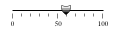

modbus
------

이제 네트워크가 연결되고 ssh 터널을 통해 서버에서
원격시스템을 제어할 수 있으므로, 
원격시스템을 원격지에 설치해 두어도 된다. 하지만, 아직 모니터링 기능을
자동적으로 수행할 수는 없다. 본 절에서는 modbus 프로토콜에 대해 
알아보고, 이를 이용해 모니터링한 내용을 서버로 전송하고 
서버에서 원격시스템을 제어할 수 있는 방법에 대해 살펴볼 것이다.

modbus 소개
^^^^^^^^^^^
본 절은 wikipedia의 `modbus <http://en.wikipedia.org/wiki/Modbus>`_
를 번역하면서 약간을 살을 붙인 것이다.

모드버스는 1997년, 지금은 Schneider Electric인 Modicon 이라는 
회사에서 만든 시리얼 통신 프로토콜이다. 제조공장이나 놀이공원의 
기계들을 자동화하고 제어하는 목적으로 사용되는 Programmable Logic 
Controller(PLC)들과의 통신에 사용할 목적으로 만들어졌다. 
프로토콜이 단순하지만, 장비 제어와 모니터링에 필요한 기능들을 
수행할 수 있기에 사실상의 표준 프로토콜의 지위를 얻게 되었고, 
현재까지 산업용 전자 장치들을 서로 연결하는 목적으로 
널리 사용된다. 다음은 모드버스가 산업용으로 널리 사용되는 이유들이다.

* 산업용 통신 프로토콜로 개발됨
* 프로토콜이 공개되어 있고 공짜
* 설치와 유지보수가 용이
* 비트단위 또는 워드(16bits) 단위로 정보조작이 용이

모드버스는 약 240개의 장비들을 서로 연결할 수 있다. 
예를 들면, 온도와 습도를 측정하는 여러 장비들이 모니터링 
서버로 현재 상태를 보고하도록 할 수 있다. 
일반적으로 서버에서 센싱 장비들에게 질의를 보내고 장비들은 
이에 대해 응답하는 형태로 동작한다. Supervisory control and 
data acquisition (SCADA) 시스템에서도 모니터링 서버와 
remote terminal unit (RTU)을 연결하기 위해 모드버스를 자주 사용한다.

Schneider Electric에서는 모드버스를 공개하여, 2004년 4월 이후로 
프로토콜의 개발과 수정을 Modbus Organization에서 수행한다.

통신과 장비
"""""""""""

모드버스는 master/slave 기반 프로토콜이다. 시리얼 통신에서는 
master로 설정된 장비만이 slave로 정보를 요청할 수 있는 반면, 
이더넷 통신에서는 네트워크상의 어떤 노드도 정보를 요청할 수 
있다. 요청정보는 읽기와 쓰기 모두 가능하다. 하지만, 대부분의 
경우 master는 하나만 존재한다. 

네트워크상에 연결된 모든 노드들이 요청을 받을 수는 있지만, 
요청정보에 들어있는 목적주소 장비만이 이에 응답한다. 
물론 목적지 주소가 브로드캐스트 주소일 때는 예외이다. 
목적지 주소를 0으로 설정하면, 수신한 모든 노드에서 요청을 
처리하지만, 응답은 보내지 않는다. 또한, 모드버스 요청 
정보에는 통신 오류를 검출하기 위한 코드를 포함한다.

모드버스를 지원하는 모뎀과 게이트웨이들이 많이 존재한다. 
주로 serial-to-IP 제품들로 master측으로는 WiFi나 이동통신등 
무선통신을 지원하기도 한다.

프레임 포맷
"""""""""""
통신 네트워크의 종류와 요청 정보의 형식에 따라 여러가지 프레임 
포맷이 존재한다.   Modbus RTU는 시리얼 통신망을 이용하며, 
프레임에서는 이진정보를 사용한다. Modbus Ascii도 시리얼 통신망을 
이용하지만, 프레임에 ascii 문자를 넣어 통신한다. 즉 0을 넣으면, 
실제 프레임에는 0의 ascii 코드인 48이 한 바이트를 차지하게 된다.

.. table:: Modbus RTU Frame Format

    +--------------+---------------+--------------------------------------------------------------+
    | Name         | Length (bits) | Function                                                     |
    +==============+===============+==============================================================+
    | Start        | 28            | at least 3 1⁄2 character times of silence (mark condition)   |
    +--------------+---------------+--------------------------------------------------------------+
    | Address      | 8             | Station Address                                              |
    +--------------+---------------+--------------------------------------------------------------+
    | ``Function`` | 8             | Indicates the function code, eg read coils / inputs          |
    +--------------+---------------+--------------------------------------------------------------+
    | ``Data``     | n * 8         | Data + length will be filled depending on the message type   |
    +--------------+---------------+--------------------------------------------------------------+
    | CRC          | 16            | Error checks                                                 |
    +--------------+---------------+--------------------------------------------------------------+
    | End          | 28            | at least 3 1⁄2 character times of silence between frames     |
    +--------------+---------------+--------------------------------------------------------------+

|

.. table:: Modbus ASCII Frame Format

    +--------------+----------------+-------------------------------------------------------------------------+
    | Name         | Length (char.) | Function                                                                |
    +==============+================+=========================================================================+
    | Start        | 1              | starts with colon ( : ) (ASCII hex value is 0x3A)                       |
    +--------------+----------------+-------------------------------------------------------------------------+
    | Address      | 2              | Station Address                                                         |
    +--------------+----------------+-------------------------------------------------------------------------+
    | ``Function`` | 2              | Indicates the function codes like read coils / inputs                   |
    +--------------+----------------+-------------------------------------------------------------------------+
    | ``Data``     | n              | Data + length will be filled depending on the message type              |
    +--------------+----------------+-------------------------------------------------------------------------+
    | LRC          | 2              | Error checks                                                            |
    +--------------+----------------+-------------------------------------------------------------------------+
    | End          | 2              | carriage return – line feed(CR/LF) pair (ASCII values of 0x0D & 0x0A)   |
    +--------------+----------------+-------------------------------------------------------------------------+

|

.. table:: Modbus TCP Frame Format

    +------------------------+----------------+---------------------------------------------------------+
    | Name                   | Length (bytes) | Function                                                |
    +========================+================+=========================================================+
    | Transaction Identifier | 2              | For synchronization between messages of server & client |
    +------------------------+----------------+---------------------------------------------------------+
    | Protocol Identifier    | 2              | Zero for Modbus/TCP                                     |
    +------------------------+----------------+---------------------------------------------------------+
    | Length Field           | 2              | Number of remaining bytes in this frame                 |
    +------------------------+----------------+---------------------------------------------------------+
    | Unit Identifier        | 1              | Slave Address (255 if not used)                         |
    +------------------------+----------------+---------------------------------------------------------+
    | ``Function code``      | 1              | Function codes as in other variants                     |
    +------------------------+----------------+---------------------------------------------------------+
    | ``Data bytes``         | n              | Data as response or commands                            |
    +------------------------+----------------+---------------------------------------------------------+

Modbus/TCP의 unit identifier는 modbus 게이트웨이 내부의 RTU 장비들을 
지칭할 목적으로 사용되며, 이런 경우가 아니라면 IP 주소를 사용해 목적지를 
인식할 수 있으므로 사용되지 않는다.  
바이트 순서는 빅 엔디언을 사용한다. 즉 첫번째 바이트가 MSB이다.

프레임 포멧의 Function code와 data부분을 특별히 Protocol Data Unit 
(PDU)라고 부르며, 위 프레임 포맷 표에서 Name 부분에 푸른색으로 표시된 
부분이 PDU이다.  PDU는 Request PDU, Response PDU, Exception Response 
PDU의 3가지 종류가 정의되어 있으며, 아래는 요청(Request)과 
응답(Response)의 과정을 해당 주체와 함께 간단히 표시한 그림이다.

요청을 받은 slave에서 해당 메시지를 해석할 수 없거나, 
명시된 주소를 찾을 수 없는 등의 오류 발생시에는 요청의 function 
code에 0x80을 더한 값을 오류 코드로 설정하여 Exception Response로 응답한다.

지원되는 기능 코드들
""""""""""""""""""""
읽기와 쓰기를 비롯한 다른 몇몇 기능들이 아래 표에 정리되어 있다. 
프로토콜이 만들어진 초창기부터 있었던 기능들은 굵은 글자로 
표시되어 있으며, 1~6까지의 기능 코드를 갖는다.

+---------------+--------------------+-------------------------------------------------+----------------------------------+---------------+
| Function type | .                  | .                                               | Function name                    | Function code |
+===============+====================+=================================================+==================================+===============+
| Data Access   | Bit access         | Physical Discrete Inputs                        | **Read Discrete Inputs**         | 2             |
+---------------+--------------------+-------------------------------------------------+----------------------------------+---------------+
| .             | .                  | Internal Bits or Physical Coils                 | **Read Coils**                   | 1             |
+---------------+--------------------+-------------------------------------------------+----------------------------------+---------------+
| .             | .                  | .                                               | **Write Single Coil**            | 5             |
+---------------+--------------------+-------------------------------------------------+----------------------------------+---------------+
| .             | .                  | .                                               | Write Multiple Coils             | 15            |
+---------------+--------------------+-------------------------------------------------+----------------------------------+---------------+
| .             | 16-bit access      | Physical Input Registers                        | **Read Input Register**          | 4             |
+---------------+--------------------+-------------------------------------------------+----------------------------------+---------------+
| .             | .                  | Internal Registers or Physical Output Registers | **Read Holding Registers**       | 3             |
+---------------+--------------------+-------------------------------------------------+----------------------------------+---------------+
| .             | .                  | .                                               | **Write Single Register**        | 6             |
+---------------+--------------------+-------------------------------------------------+----------------------------------+---------------+
| .             | .                  | .                                               | Write Multiple Registers         | 16            |
+---------------+--------------------+-------------------------------------------------+----------------------------------+---------------+
| .             | .                  | .                                               | Read/Write Multiple Registers    | 23            |
+---------------+--------------------+-------------------------------------------------+----------------------------------+---------------+
| .             | .                  | .                                               | Mask Write Register              | 22            |
+---------------+--------------------+-------------------------------------------------+----------------------------------+---------------+
| .             | .                  | .                                               | Read FIFO Queue                  | 24            |
+---------------+--------------------+-------------------------------------------------+----------------------------------+---------------+
| .             | File Record Access | .                                               | Read File Record                 | 20            |
+---------------+--------------------+-------------------------------------------------+----------------------------------+---------------+
| .             | .                  | .                                               | Write File Record                | 21            |
+---------------+--------------------+-------------------------------------------------+----------------------------------+---------------+
| Diagnostics   | .                  | .                                               | Read Exception Status            | 7             |
+---------------+--------------------+-------------------------------------------------+----------------------------------+---------------+
| .             | .                  | .                                               | Diagnostic                       | 8             |
+---------------+--------------------+-------------------------------------------------+----------------------------------+---------------+
| .             | .                  | .                                               | Get Com Event Counter            | 11            |
+---------------+--------------------+-------------------------------------------------+----------------------------------+---------------+
| .             | .                  | .                                               | Get Com Event Log                | 12            |
+---------------+--------------------+-------------------------------------------------+----------------------------------+---------------+
| .             | .                  | .                                               | Report Slave ID                  | 17            |
+---------------+--------------------+-------------------------------------------------+----------------------------------+---------------+
| .             | .                  | .                                               | Read Device Identification       | 43            |
+---------------+--------------------+-------------------------------------------------+----------------------------------+---------------+
| Other         | .                  | .                                               | Encapsulated Interface Transport | 43            |
+---------------+--------------------+-------------------------------------------------+----------------------------------+---------------+

모드버스는 센서나 LED등을 모니터링하고 제어하기 위한 특수한 data 
type들을 제공한다. 다음 표에 data type들을 정리하였다. 이 표는 
http://jamod.sourceforge.net/kbase/protocol.html 에서 가져온 것이다.
java 로 구현한 modbus에 대한 문서이며, 볼 만한 내용들이 있다.

.. |discrete_input| image:: _static/modbus/discrete_input.png
.. |discrete_output| image:: _static/modbus/discrete_output.png

.. |holding_register| image:: _static/modbus/holding_register.png

<Modbus Data Type>

==============================    ===========       ==========      ==================
Name	                          Type	            Access	        Visual
==============================    ===========       ==========      ==================
Discrete Input	                  single bit	    read-only	    |discrete_input|
Discrete Output (Coils)	          single bit	    read-write	    |discrete_output|
Input Registers	                  16-bit word	    read-only	    |input_register|
Holding Registers (Registers)     16-bit word	    read-write	    |holding_register|
==============================    ===========       ==========      ==================

구현들
""""""
모드버스의 구현은 시리얼 통신에 사용할 수 있는 모드버스와 IP 통신망에서 
사용할 수 있는 모드버스가 존재한다. 

시리얼 통신에 사용되는 대표적인 규격은 RS-232와 RS-485가 있다. 
RS-232는 가까운 거리에 놓인 두 장비를 1:1로 연결하는 용도로 사용된다
(RS-422은 RS-232에 양방향 통신기능을 추가한 것이다). 
RS-485는 여러 장비들을 하나의 망으로 묶을 수 있으며, 
하나의 master에서 여러 개의 slave들과 통신할 수 있다.

시리얼 전송 모드는 데이터의 인코딩 방식에 따라 아스키와 RTU로 
다시 나누어진다. 아스키 모드에서는 바이트는 두 개의 아스키 문자로 
기록되어 데이터 전송효율은 떨어지지만, 디버깅등에서 사람이 데이터를 
읽기에는 더 편리한 점이 있다. RTU 모드에서는 이진 데이터를 그대로 
전송에 이용한다.
  
IP 기반의 모드버스 구현은 TCP와 UDP 모두 가능하며, IETF에서 502 
포트를 할당받았다.

대부분의 모드버스 구현들은 필요에 의해 프로토콜을 약간씩 
변형하여 구현하였다. 그러므로 변형된 부분에 대해서는 
서로 호환이 되지 않을 수 있다. 다음은 변형된 부분들에 대한 내용이다:

* Data types
  - Floating point IEEE
  - 32-bit integer
  - 8-bit data
  - Mixed data types
  - Bit fields in integers
  - Multipliers to change data to/from integer. 10, 100, 1000, 256 ...
* Protocol extensions
  - 16-bit slave addresses
  - 32-bit data size (1 address = 32 bits of data returned.)
  - Word swapped data

제한
""""

* 모드버스는 1970년대 말에 만들어졌기 때문에 그 당시 사용되던 PLC 
  장비들에서 사용되던 data type들만을 지원한다.  
  이전 절의 변형된 data type들을 참고하라.
* data object는 오직 주소에 의해서만 결정되며, 설명을 넣을 수 없다.
* Master의 요청 없이 slave에서 특정 이벤트에 의해 master로 메시지를 
  전달할 수 있는 방법이 없다(Modbus TCP에서는 가능은 함).
* 시리얼 네트워크에서는 247개의 노드까지만 네트워크에 연결할 수 있다
  (Modbus TCP에서는 IP 주소가 허용하는 범위에서 할당 가능).
* 데이터는 연속적으로 전송해야 한다. 버퍼링을 위해 하나의 메세지를 
  중간에 끊어서 전송할 수 없다.
* 통신 보안을 제공하지 않는다.

libmodbus
^^^^^^^^^
모드버스를 구현한 라이브러리로는 대표적으로 libmodbus를 뽑을 수 있다. 
c로 구현된 라이브러리로 리눅스, 맥, 윈도우 등 대부분의 OS에서 사용할 
수 있으며, 꾸준히 업데이트가 되고 있다. 

본 글에서는 Modbus RTU의 예제를 libmodbus를 이용하여 살펴보고, 
Modbus TCP에 대해서는 pymodbus를 사용하여 예제를 구동시킬 것이다. 
테스트 환경은 ubuntu 12.04와 13.04이다.

libmodbus 설치
""""""""""""""
http://libmodbus.org/download/ 에서 최신버전을 다운받아 적당한 곳으로 옮긴 후 아래 명령을 이용하여 압축을 푼다.

.. code-block:: sh

    $ tar zxvf libmodbus-3.0.5.tar.gz 

libmodbus-3.0.5 폴더로 이동한 후 아래와 같이 컴파일한다.

$ cd libmodbus-3.0.5/
$ ./configure
$ make
libmodbus를 라이브러리로 사용하기 위해서는 make install을 해 주어야 하지만, 본 글에서는 modbus RTU의 동작만을 살펴본다.
2.2 Modbus RTU 구동 예제
