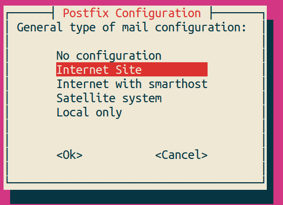
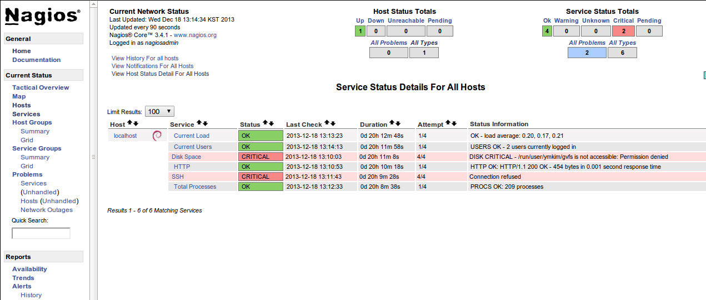
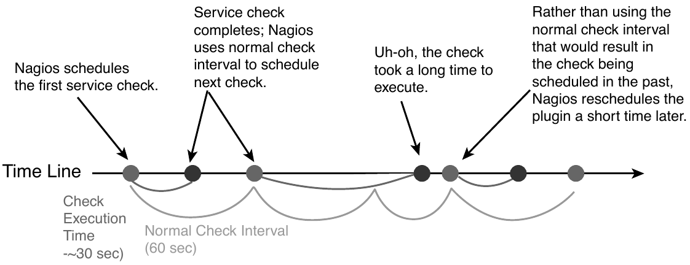
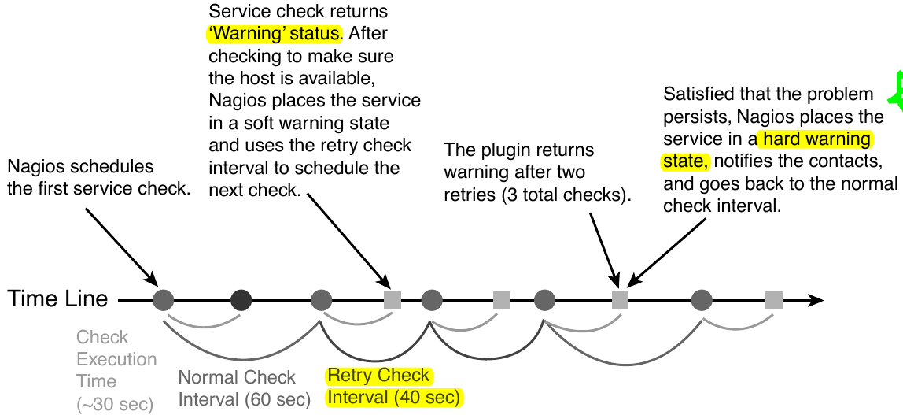

nagios
------

모니터링이 무엇이냐고 묻는다면, 뭐라고 답할 수 있을까?
modbus와 syslog, nagios 차원에서의 답은 이런식이 아닐까 한다.

=============       ===================================================================================================================
모니터링 방법       모니터링이란
=============       ===================================================================================================================
modbus              원격시스템의 변화하는 값들을 주기적으로 관찰하여 표시하고, 필요할 경우 서버에서 원격시스템의 설정값을 변경한다.
syslog              원격시스템에서 발생하는 이벤트 메시지를 서버에서 통합관리한다.
nagios              서버에서 원격시스템에게 정의된 내용을 묻거나, 원격시스템에 정의된 이벤트가 발생할 경우 서버로 보고한다. 단순 정보 수집에 그치지 않고 미리 정해진 횟수 만큼 연속적으로 오류가 발생하면, 정해진 관리자들에게 알림 기능을 제공한다.
=============       ===================================================================================================================

..
    새로운 정보를 추가하거나 필요없는 정보를 빼고자 할 때, 
    유연성(flexibility) 차원에서는 아래와 같은 비교가 가능하다.

    =============       =========================
    모니터링 방법       유연성
    =============       =========================
    modbus              O (모니터링 대상을 추가하고 뺄 수 있지만, 변화된 레지스터의 내용을 별도로 유지해야 함. 즉, 모니터링 값의 의미를 설명하는 문서를 요구함) 
    syslog              OO (원하는 로그를 추가하고 필요없는 로그를 빼는 과정이 매우 용이함. 로그 자체에 모니터링 내용이 설명됨)
    nagios              X (모니터링 항목의 추가 및 삭제가 비교적 복잡함)
    =============       =========================

정보의 방향 차원에서는 아래표를 보라.

=============       =========================
모니터링 방법       정보의 방향
=============       =========================
modbus              양방향 (서버 주도: 서버에서 질의를 보내고 원격시스템에서 응답을 받는 형식)
syslog              단방향 (원격시스템에서 서버로 로그 메시지 전달)
nagios              양방향 (원격시스템에서 서버로 정보를 전달할 수도 있고 서버 주도로 정보를 수신하거나 원격시스템을 제어할 수도 있음)
=============       =========================

nagios는 간단한 명령어에서 스케쥴링, 웹 UI 까지 넓은 영역을 포함하고 있어
한마디로 쉽게 설명하기 어렵다.

.. note:: `Icinga <https://www.icinga.org/>`_, `Shinken <www.shinken-monitoring.org/>`_ 등 nagios 와 동일한 또는 비슷한 기능을 하는 소프트웨어 변종들이 존재한다.

nagios 설치
^^^^^^^^^^^

.. note:: 이 절은 http://askubuntu.com/questions/145518/how-do-i-install-nagios 을 참고하여 작성되었다.

ubuntu에서 nagios 설치는 간단하다.
apache는 이미 설치되어 있다는 가정하에 아래 명령을 수행한다.

::

  $ sudo apt-get install -y nagios3

명령 수행 후 몇 몇 입력창을 보게 될 것이다.  
제일 먼저 나오는 창은 메일 전송을 담당하는 postfix 에 대한 설정이다.
postfix는 nagios를 설치하고 웹화면을 구경한 후에 설치 및 설정할 수 
있으므로 이 시점에서 중요한 부분은 아니라고 할 수 있다.
"Postfix Configuration" 이 제목인 첫 창에서 OK를 클릭한 후 아래와 같이
Internet Site를 선택한다. 

다음에 나오는 도메인 네임은 보내는 메일 주소에 사용될 @의 뒷 부분을
입력한다.

다음으로는 nagios 웹 화면에 접속할 비밀번호를 입력하는 창이 나온다.
아이디는 nagiosadmin 이며, 이 아이디와 여기서 입력한 비밀번호로
웹화면에 로그인 할 수 있다.

설치를 마친 후 브라우저에서 ``http://localhost/nagios3`` 를 입력하면
로그인 창이 나오고 아이디와 비밀번호를 입력하면 nagios 웹 화면을
볼 수 있다.

nagios는 기본적으로 localhost의 load, 현재 사용자, 디스크 공간
등을 검사하도록 설정화일을 자동으로 생성한다. nagios 웹 화면 좌측
메뉴에서 ``services`` 를 누르면 아래와 같이 기본으로 설정된 항목들을
볼 수 있다(ubuntu 13.04 환경).

.. note:: Disk Space와 SSH에서 발생한 에러에 대해서는 https://help.ubuntu.com/community/Nagios3 에서 Post Install Tasks를 참고하라.

이제 nagios 설치를 완료하였으므로 설정을 해야 하지만, 그전에
nagios의 기본 개념에 대한 이해를 하고 넘어가자.

nagios core에 대한 간단한 소개
^^^^^^^^^^^^^^^^^^^^^^^^^^^^^^
.. note:: 이 절은 David Dosephen의 Building a Monitoring Infrastructure with Nagios 를 참고하여 작성되었다.

nagios의 핵심은 작은 크기의 모니터링 프로그램인 plugin 의 스케쥴링과 
알림(notification)을 위한 프레임워크라고 정의할 수 있다.
본 절에서는 nagios plugin의 원리와 구조에 대해 알아본 후, 
nagios의 스케쥴링에 대해 알아보고자 한다.

nagios plugin
"""""""""""""
plugin은 exit 코드를 반환하여 plugin의 실행결과를 nagios에게
알릴 수 있으며,
exit 코드는 아래와 같은 의미를 갖는다.

+------+----------+
| Code | Meaning  |
+======+==========+
| 0    | Ok       |
+------+----------+
| 1    | Warning  |
+------+----------+
| 2    | Critical |
+------+----------+
| 3    | Unknown  |
+------+----------+

.. note:: ls와 같은 유닉스 명령어도 nagios plugin과 동일한 방식으로 exit code를 반환하며, ``echo $?`` 명령어로 결과를 확인할 수 있다.

nagios plugin은 exit code 이외에도 문자열을 반환하여 세부 정보를 관리자에게
알릴 수 있다.
다음은 예제 plugin이며,
echo문에서 문자열을 출력하고 exit문으로 exit code를 반환한다.

.. code-block:: sh

    #!/bin/sh
    OUTPUT='ping -c5 8.8.8.8 | tail -n2'
    if [ $? -gt 0 ]
    then
        echo "CRITICAL!! $OUTPUT"
        exit 2
    else
        echo "OK! $OUTPUT"
        exit 0
    fi

nagios plugin의 역할은 다음 두가지로 나눌 수 있다.

* Host로부터 정보를 가져온다. (예, CPU 로드, index.html)
* Host의 특정 상태나 비교 결과를 exit code로 반환한다. 

이상의 내용에서 알 수 있는 바와 같이 nagios plugin은 독립적인 
명령어의 역할도 수행할 수 있으므로 테스트 목적으로 간단하게
사용해 볼 수 있다.

.. note:: nagios에서는 많은 수의 plugin을 제공하고 있다. https://www.nagios-plugins.org/ 를 참고하라.

원격지의 호스트에 대해서도 nagios를 실행할 수 있다. 이 절에서는
ssh를 이용한 원격 모니터링의 원리 설명에 집중할 것이다.
원격 호스트의 상태를 모니터링하기 위해서 ssh의 원격지 명령어 수행방법을
이용한다. 아래 명령은 원격 호스트 example.org의 
test 계정 홈 디렉토리에서 ls를 수행한
결과를 반환한다.

::
    
    $ ssh test@example.org "ls -CF"
    build/				 log/
    tmp/
    
이 명령어에서 "ls -CF" 부분을 nagios plugin으로 교체하면 ssh 문 
자체로 nagios plugin과 같은 역할을 하게 된다. 

원격호스트(example.org)에 
``/usr/local/bin/load_checker.sh`` 를 생성하고 아래 코드를
내용으로 입력하라. 시스템 부하의 값이 1를 넘어가면 Critical 오류를
발생시키는 코드이다.

.. code-block:: sh

    #!/bin/bash
    LOAD=`uptime | awk '{print $12}'`

    if (( $(bc <<< "$LOAD > 1") ))
    then
        echo "Critical! load on 'hostname' is $LOAD"
        exit 2
    else
        echo "OK! Load on 'hostname' is $LOAD"
        exit 0
    fi

다음 명령을 실행하여 실행권한을 주고 실행시켜 보자.

::

    $ sudo chmod a+x /usr/local/bin/load_checker.sh
    $ load_checker.sh
    OK! Load on 'hostname' is 0.15
    $ echo $?
    0
    
이제 아래 명령으로 원격호스트의 명령을 실행시킬 수 있다.

::
    
    $ ssh test@example.org /usr/local/bin/load_checker.sh
    OK! Load on 'hostname' is 0.13
    $ echo $?
    0
    
위의 ssh 문을 nagios의 plugin으로 만들기 위해 아래와 같은 스크립트를 
작성하여 서버에 저장한다.

.. code-block:: sh

    #!/bin/sh
    #get the ouput from the remote load_checker script
    OUTPUT=`ssh test@example.org "/usr/local/bin/load_checker.sh"`

    #get the exit code
    CODE=$?
    echo $OUTPUT
    exit $CODE

nagios 서버에 위치한 위 코드는 완벽한 nagios plugin으로 
원격호스트의 시스템 부하에 대한 출력문과 
exit 코드를 반환한다.

이 방법은 nagios에서의 원격 모니터링 원리를 잘 설명하지만,
하나의 단점이 존재한다. 서버에서 원격 시스템으로 로그인 없이
ssh 접속이 가능해야 한다. 
이에 대해서는 :ref:`remote-ssh` 을 참고하라.

nagios에서는 ssh를 이용하는 방법이외에 nagios에서 개발한
NRPE (Nagios Remote Plugin Executor)를 이용해 원격시스템의
모니터링을 수행할 수 있다. 자세한 방법은 각자 알아보시고,
여기서는 이 정도로 마무리하고자 한다.

host 와 service
"""""""""""""""
아래 명령어를 cron에 등록해 두면 특정 서버로의 연결이 불가능할 
경우 이메일을 받을 수 있다. 이 명령은 icmp 메시지 5개를
server1으로 전송하여 한번이라도 응답을 받지 못했을 경우
서버가 다운되었다는 메시지를 메일주소로 보내는 스크립트이다.

::

    $ ping –qc 5 server1 || (echo "server1 is down" | mail dude@domain.org)

간단하면서도 강력한 모니터링 방법이라고 할 수 있다. 하지만, 이 방법에는
약간의 문제가 있다. 관리하는 서버가 40대 있다고 하자.
모니터링 정비와 원격 서버들 사이의 라우터에 고장이 발생했을 경우,
관리자는 40개의 중복된 메일을 한꺼번에 받게 된다.
또, 메일을 받을 사람이 늘어나면, 메일링 리스트를 관리해야 한다.
모니터링 항목에 따라 그룹핑을 해야 할 경우에는, 두 개이상의 
메일링 리스트에 포함되어 중복된 메일을 수신하는 사람이 생길 것이다.
nagios는 바로 이런 문제를 해결하는 방법을 제시하며, 이 과정에서 
host와 service의 개념을 정의하였다.

host는 인터넷에 연결된 장비를 가리키며, service는 host에서 제공하는
소프트웨어 데몬을 의미한다. 그러므로 하나의 장비에 대해 host는 up/down
의 단일 정보만 존재하지만, service에 대해서는 여러 개의 서비스 check들이
있을 수 있다.

host 와 service의 구분이 필요한 이유는 다음과 같다. 
host로의 접근이 불가능한 상태에서 그 host의 service에 대한 점검을
진행하지 않으며, host가 up 상태일때만, service에 대한 스케쥴링을 수행한다.

이와 같은 계층구조를 host간에 또는 service간에도 설정할 수 있다.
host들 간에는 앞으로 언급할 설정화일에서 parents 지시자(directive)를
사용하여 설정하며, 물리적인 계층 구조로 설명할 수 없는 경우에는 
의존성 정의 (dependency defintions)를 이용하여 논리적 계층구조를 
정의한다.

host 와 service 개념으로 나타내기 어려운 모니터링 대상도 있다.
예를 들어 대학내의 메일 서비스를 예로 들면 메인 메일 서버와 
메일을 전송하는 통신 장비들, 사용자용 웹 메일 관리자 등 여러 host와
service들이 하나의 통합 서비스를 구성하는 경우도 있다. 
이런 경우를 위해 nagios에서는 host group과 service group이라는 개념을
제시한다. 즉 하나의 service group을 구성하는 host들과 service들을 
하나로 묶어서 관리할 수 있는 기법이다.

nagios 웹 화면의 왼쪽 메뉴를 보면 "hosts"와 "services", 
"host groups", "service groups"가 있다. nagios 웹을 활용할 때
제일 많이 볼 내용들이므로 이 시점에서 한 번씩 보면 좋을 것 같다.
물론 아직 아무런 설정도 하지 않아, localhost에 대한 내용만 들어
있지만, 이 곳에 나의 목적상
무엇이 추가될 수 있는지 각자 고민해 보기 바란다.

스케쥴링
""""""""
사용자 입장에서 보면, nagios는 주기적으로 plugin을 수행하면서
exit code에 변화가 발생할 때 사용자에게 알려주는 역할을 한다.
여기서 주기적으로 plugin을 수행할 때 어떤 주기로 진행되는지, 
그리고 exit code가 우연히 한번만 변화했을 때가 아니라 몇 번 동안
변화된 값을 유지하는지에 따라 상태 변화가 있는 것으로 간주하는지를
결정하는 방식을 스케쥴링(scheduling)에서 처리한다.

service에 대한 점검은 host가 살아있는 상태에서만 의미를 갖는다.
그러므로 일반적인 상황에서
host에 대한 점검은 service에 대한 plugin에서 오류
(0이 아닌 exit 코드값)를 반환할
때에만 수행된다.

cron에서는 명시적인 날짜와 시간을 이용하여 특정 작업을 수행한다.
하지만, nagios에서는 plugin에서 결과값을 반환할 때까지 기다리는 
시간을 정해 스케쥴링을 수행한다.
이 지점에서 중요한 두 가지 점이 있을 수 있다.

* plugin을 정해진 시간에 수행할 수 있는가?
* 정해진 시간 내에 plugin의 수행을 완료할 수 있는가?

첫 번째 지적에 대해, 정상적인 또는 시스템에 여유가 있는 상황에서는
정해진 시간에 plugin을 실행할 수 있겠지만, 관리하는 모니터링의 대상이
많아질수록 제시간에 실행하지 못하는 상황이 발생할 수 있다.
제때에 실행하지 못했을 경우 다음 스케쥴링은 지연되지 않고 원래 실행되었어야 
할 시간을 기준으로 그 다음 스케쥴링 시간에 plugin을 실행하기 위해 시도한다.

두 번째 경우에서는, 네트워크의 문제 등으로 결과값을 받는데까지 걸리는
시간이 길어질 수 있다.
다음 그림은 두 번째 경우에 대해 잘 설명해 주고 있다.

"Normal check interval"은 설정화일에서 정해지는 값으로 
exit 코드 0(OK)을 반환할 경우의 스케쥴링
기본 간격을 의미한다. exit 코드의 반환이 늦어지는 경우에는
"Normal check interval"을 무시하고 결과값을 받은 잠시 후에 plugin의 
수행을 시도한다.

"Normal check interval"의 반대되는 개념으로 "retry check interval"이
존재한다. 0 이외의 exit 코드를 반환한 경우 해당 오류가 지속되는지를
검사하기 위한 간격이다. 정해진 횟수
(max check attempts)만큼 plugin 실행 오류가 지속될 경우
관리자에게 메일을 전송한다. "Max check attempts"에는 최초의 오류를 
감지한 건도 포함한다. 그러므로 "max check attempts"를 1로 설정하면,
재시도 없이 바로 ``notification`` 을 발생시킨다.

아래 그림은 "Max check attempts"를 3으로 설정한 환경에서
plugin 실행 오류 발생시 check interval의 변화를 나타낸다.

nagios 설정
^^^^^^^^^^^

email notification
^^^^^^^^^^^^^^^^^^
