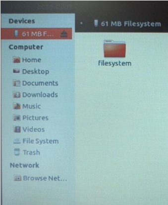
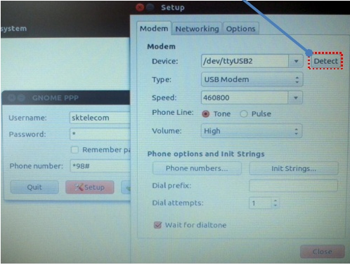
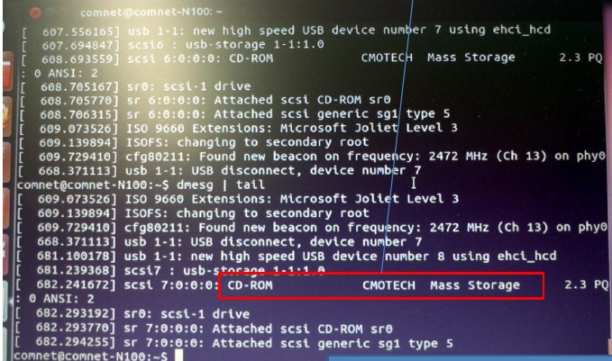
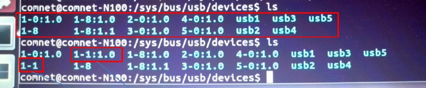

원격시스템을 위한 무선이동통신
------------------------------
원격시스템은 유선전원연결은 가능하지만, 유선통신은 불가능한 환경을 
가정한다. 유선통신이 불가능하기 때문에 무선통신을 이용해야 한다. 
요즘 흔히 이용할 수 있는 무선통신은 무선랜과 상용이동통신망이 있다.
무선랜은 초기 설치 비용이 많이 들 수 있다. 무선랜 AP를 설치할 곳을 
확보해야 하며, 인터넷 선도 끌어와야 한다. 이상한 사람들이 장비를
훼손시키지 못하도록 안전장비도 갖추어야 한다. 이런 일들은 예상외로 
많은 비용이 든다. 이런 이유로 본 절에서는 상용이동통신망을 사용하는 
것을 가정하고 설명할 것이다.

국내 이동통신 3사는 모두 데이터 통신이 가능한 모뎀과 서비스를 판매하고 
있다. 모뎀은 크게 두 가지 형태로 나눌 수 있다. 하나는 KT에서 판매하는
애그(egg)로 유명해진 독립장비로서의 모뎀이다.
이 장비는 로컬에서는 무선랜으로 클라이언트들의 접속을 허용하고 인터넷
연결을 위해서는 3G나 Wibro, LTE 망을 이용하는 형태이다. 이 제품의 특징은
하나의 장비로 여러 클라이언트들에게 서비스를 제공할 수 있다는 것이다.
또 다른 형태는 USB 타입의 모뎀이다. SKT에서 판매하는 T Login 이 대표적이며,
KT에서도 iplug라는 이름으로 판매한다.

에그 타입    
^^^^^^^^^

USB 타입
^^^^^^^^
실험에 사용한 ubuntu 버전은 11.10이지만, 그 이후의 버전들에서 잘 
동작할 것으로 생각한다.
본 절에서 사용할 USB 타입 모델은 2012년 초에 구입하였으며, 모델명은 
아래와 같다.

* SKT T-Login 듀얼 CBU-450D
* KT iplug CHU-629K 

.. warning::

 통신 모뎀은 스마트폰에 비해 구입하기가 훨씬 까다로웠다. 대리점 방문전에
 전화로 확인해 보거나 인터넷으로 구매처를 확인해 보라.

SKT T-Login은 KT 모뎀에 비해 쉽게 설치가 가능하다. 3가지 방법으로 사용이
가능하며, 첫번째 방법은 ubuntu에서 기본적으로 제공하는 네트워크 연결
프로그램을 이용하는 것이다. 두번째 방법은 gnome-ppp 라는 프로그램을
이용하는 방법이며, 마지막으로 wvdial을 이용하는 방법이 있다. 첫 두가지 방법은
반드시 GUI 환경이 필요한 방법이며, wvdial은 명령어와 옵션만으로 실행이
가능하다.

ubuntu에서는 유무선랜 연결을 관리하기 위한 프로그램을 내장하고 있으며,
GUI환경에서 우상단의 트레이 아이콘을 눌러 조작할 수 있다.
USB 모뎀을 연결하고 2분정도를 기다리면, Natilus 에서 다음과 같이 USB 
저장장치가 
잡힌 것을 확인할 수 있다. 
`usb_modeswitch <http://www.draisberghof.de/usb_modeswitch/>`_
라는 프로그램이 이 일을 자동으로 처리해 준다.
즉 usb_modeswitch는 USB 타입 모뎀을 USB 저장장치로 인식한 후 통신 기능을 
활성화 시킨다.
먼저 USB 저장장치로 인식된 상태를 다음 창으로 확인할 수 있다.
 

이후 통신 기능이 활성화 되고 나면, 통신 아이콘을 눌렀을 때 
아래와 같이 sk-telecom이라고 써지며, 이를 누르면 통신이 연결된다.

.. image:: _static/network/sk_modem2.png

두번째 방법인 gnome-ppp는 별도로 설치를 해야 하는 GUI 프로그램이며, 
아래에서 "detect" 버튼을 누르면 /dev/ttyUSB2 와 같은 디바이스로 
통신 모뎀이 잡힌다(`참고 <http://blog.naver.com/PostView.nhn?blogId=dowkim10&logNo=120109842782>`_).

마지막으로 wvdial을 이용하는 방법이다. 이 명령어는 gnone-ppp가 수행하는
기능을 콘솔에서 수행가능하도록 한다(gnome-ppp를 설치하면 wvdial도
설치된다). 설정화일을 직접 작성하거나
아래 방법을 이용해 자동으로 생성할 수 있다. 이 명령을 수행하면 
/etc/wvdial.conf 에 설정화일이 저장된다. gnome-ppp에서 detect 과정과
매칭된다고 할 수 있다.

.. code-block:: sh

    $ sudo wvdialconf

아래는 이렇게 자동생성된 설정화일을 약간 수정한 내용이다.

.. code-block:: c

    [Dialer Defaults]
    init1 = ATZ
    init2 = ATQ0 V1 E1 S0=0 &C1 &D2 +FCLASS=0
    init3 = AT&F
    ISDN = 0
    Modem Type = USB Modem
    New PPPD = yes
    Phone = *98#
    Modem = /dev/ttyUSB2
    Username = sktelecom
    Password = 1
    Baud = 38400

다음, 아래 명령으로 T-Login을 네트워크에 연결한다.

.. code-block:: sh
    
    $ sudo wvdial

사실 위에서 소개한 세가지 방법은 모두 usb_modeswitch에서 
수행해 놓은 일 위에 숟가락만 얻는 사용자 인터페이스라고 
할 수 있다. 연결된 USB 통신 모뎀을 인식하고 사용할 준비를
하는 것은 usb_modeswitch이다. 

본 글에서 언급하는 원격시스템은 모든 일을 자동화 하여 스스로 
구동할 수 있어야 하므로 마지막 방법인 wvdial을 사용한다.

.. tip:: 설정된 모뎀은 ppp0 라는 이름의 장치로 설정되었는데, 이 장치로 통신이 되는지를 검사해 보기 위해서는 eth0나 wlan0 등의 기존 통신 인터페이스를 꺼야 한다. 아래 명령으로 이를 수행할 수 있다. ::
 
    $ sudo iwconfig wlan0 txpower off
    $ sudo ifconfig eth0 down

KT 모뎀을 인식시키기 위해서는 usb_modeswitch에 대한 지식이 필요하다.
먼저 iplug를 PC에 연결하고 인식과정이 어디까지 진행되었는지 살펴봐야
한다. ``dmesg`` 나 ``lsusb –v`` 명령을 이용하여 확인이 가능하며, 아래는
장치를 연결한 후 ``dmesg`` 의 실행결과이다. 장치를 CD ROM으로 까지는
인식하였으나, 아직 시리얼 통신 장치로는 인식하지 못한 상태이다.

다음은 iplug를 연결하기 전과 후의 ``/sys/bus/usb/devices`` 안의 화일을 
``ls`` 로 표시한 것이다. ``1-1`` 과 ``1-1:1.0`` 이 연결 후 추가된 것을
확인할 수 있다.

이중화

이렇게 무선이동통신을 이용할 수 있으면 원격시스템에서 서버로의 접속이 
가능해 진다. 그러나, 서버에서 원격시스템을 접근하려면 어떻게 해야 
할까? 다음 절에서 이에 대해 알아보자.
