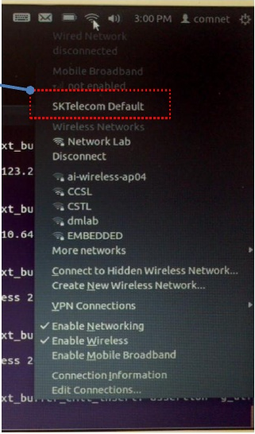

원격시스템을 위한 무선이동통신
------------------------------
원격시스템은 유선전원 연결은 가능하지만, 유선통신은 불가능한 환경을 
가정한다. 유선통신이 불가능하기 때문에 무선통신을 이용해야 한다. 
요즘 흔히 이용할 수 있는 무선통신방법으로 무선랜과 상용이동통신망이 있다.
무선랜은 초기 설치 비용이 많이 들 수 있다. 무선랜 AP를 설치할 곳을 
확보해야 하며, 인터넷 선도 끌어와야 한다. 이상한 사람들이 장비를
훼손시키지 못하도록 안전장비도 갖추어야 한다. 이런 일들은 예상외로 
많은 비용이 든다. 이런 이유로 본 절에서는 상용이동통신망을 사용하는 
것을 가정하고 설명할 것이다.

국내 이동통신 3사는 모두 데이터 통신이 가능한 모뎀과 서비스를 판매하고 
있다. 모뎀은 크게 두 가지 형태로 나눌 수 있다. 하나는 KT에서 판매하는
에그(egg)로 유명해진 독립장비로서의 모뎀이다.
이 장비는 로컬에서는 무선랜으로 클라이언트들의 접속을 허용하고 인터넷
연결을 위해서는 3G나 Wibro, LTE 망을 이용하는 형태이다. 이 제품의 특징은
하나의 장비로 여러 클라이언트들에게 서비스를 제공할 수 있다는 것이다.
또 다른 형태는 USB 타입의 모뎀이다. SKT에서 판매하는 T Login 이 대표적이며,
KT에서도 iplug라는 이름으로 판매한다.

에그 타입    
^^^^^^^^^

무선랜 AP에 접속하는 것과 동일하므로 이 절에서는 보안이 강화된 wpa 인증으로
설정된 AP에 접속하는 방법을 다루고자 한다.

무선랜(WiFi)를 이용하기 위해서는 무선랜 AP(공유기)에 접속해야 한다.
다른 사람이 사용하지 못하게 하거나, 나의 통신 내용을 다른 사람에게 
보여주지 않기 위해 보안 기법을 사용한다.
예전에는 WEP라는 방법을 많이 사용했는데, 
보안에 문제가 많다고 해서 요즘은 WPA/WPA2를 사용한다.

스마트폰이나 윈도우에서는 이 새로운 보안 기법을 사용하는데 
큰 문제가 없어 보이는데... 리눅스에서는 조금까다롭다고 생각된다.
물론 우분투에서도 GUI를 이용하면 WPA를 간단하게 이용할 수 있다. 
하지만, GUI를 사용하지 않는 서버버전 같은 경우에는 명령어를 
사용해서 WPA인증을 통과해야 하는데, 
이 과정이 조금 복잡하다.

WPA인증을 하기 위한 리눅스 명령어는 wpa_supplicant 이다. 
추가로 인증키를 만들기 위해서는 wpa_passphrase 명령어를 이용한다.
위 두 명령어만 있으면 WPA 인증을 이용할 수 있으며, 
자세한 설명은 다음 링크에서 확인할 수 있다. (https://help.ubuntu.com/community/WifiDocs/WPAHowTo)

참고로 테스트 환경은 ubuntu 12.04 server 버전이다.

간단히 과정을 설명하면, 

인증키 만들기
"""""""""""""

::

    $ wpa_passphrase NetworkEssid TextPassphrase
      # reading passphrase from stdin
      TextPassphrase
      network={
            ssid="NetworkEssid"
            #psk="TextPassphrase"
            psk=945609a382413e64d57daef00eb5fab3ae228716e1e440981c004bc61dccc98c
      }
    $ wpa_passphrase NetworkEssid TextPassphrase > wpa.conf
 
첫번째 명령어는 출력결과를 확인해 보기 위한 것이고, 
두 번째 명령어는 이 결과를 현재 폴더에 wpa.conf라는 이름으로 저장한다. 
이 화일은 wpa_supplicant 명령어의 input으로 사용되어 AP 접속에 사용된다. 
wpa_passphrase의 두 인자로 NetworkEssid와 TextPassphrase을 사용하며,
networkEssid는 무선랜 AP 검색을 하면 나오는 이름이고, 
TextPassphrase는 AP에 설정한 접속 암호이다.

무선랜 AP에 연결하기
""""""""""""""""""""

::

    $ sudo wpa_supplicant -Dnl80211 -iwlan0 -cwpa.conf
    [sudo] password for your_id: 
    Trying to authenticate with 00:07:ab:5d:f9:15 (SSID='NetworkEssid' freq=2452 MHz)
    CTRL-EVENT-DISCONNECTED bssid=00:07:ab:5d:f9:15 reason=2
    Trying to associate with 00:07:ab:5d:f9:15 (SSID='NetworkEssid' freq=2452 MHz)
    Associated with 00:07:ab:5d:f9:15
    WPA: Key negotiation completed with 00:07:ab:5d:f9:15 [PTK=TKIP GTK=TKIP]
    CTRL-EVENT-CONNECTED - Connection to 00:07:ab:5d:f9:15 completed (auth) [id=0 id_str=]

위 예제는 연결이 성공한 경우이다. 마지막 줄에 연결되었다는 설명
(CTRL-EVENT-CONNECTED)이 나오고 더 이상의 추가적인 메시지 출력이 되지 
않는다. 만약 문제가 있으면 출력문이 계속 나온다.
-D 옵션은 드라이버를 정해 주는 것이고, 
-i 옵션은 무선랜 인터페이스 이름을 지정하는 것이며, 
-c 옵션에는 인증키 만들기에서 생성한 키화일을 적어주면 된다.

인터넷을 찾아보면 나오는 대부분의 사이트에서는 드라이버로 wext를 
사용하면 된다고 나오지만, 
`NF95A-270-LF
<http://www.jetway.com.tw/jw/ipcboard_view.asp?productid=721&proname=NF95A-270-LF>`_ 에서는 wext 로 무선랜 AP 접속이 실패한다.
자신의 시스템에서 사용할 수 있는 드라이버의 종류를 보는 방법은 
아래 명령을 수행한 후, 중간쯤에 drivers라고 표시된 부분에 나와 있는 
드라이버들을 모두 적용해 보는 것이다.

::

    $ wpa_supplicant -h
    ...
    This product includes software developed by the OpenSSL Project
    for use in the OpenSSL Toolkit (http://www.openssl.org/)

    usage:
      wpa_supplicant [-BddhKLqqstuvW] [-P] [-g] \
            -i -c [-C] [-D] [-p] \
            [-b] [-f] \
            [-o] [-O] \
            [-N -i -c [-C] [-D] \
            [-p] [-b] ...]

    drivers:
      wext = Linux wireless extensions (generic)
      nl80211 = Linux nl80211/cfg80211
      wired = Wired Ethernet driver
    options:
      -b = optional bridge interface name
      -B = run daemon in the background
      -c = Configuration file
      -C = ctrl_interface parameter (only used if -c is not)
    ...

이 문제로 고민하는 분들에게 도움이 되길 기원한다.ㅋㅋ

드라이버가 맞지 않으면 다음과 같은 에러가 나온다.

::

    "WPA: 4-Way Handshake failed" 

부팅시 자동으로 WPA인증하기
"""""""""""""""""""""""""""

생성한 wpa.conf화일을 /etc 아래에 저장하시고 /etc/network/interfaces 
화일을 약간 수정한다.

::

    $sudo cp wpa.conf /etc
    $sudo vi /etc/network/interfaces

화일 내용에서 wlan0쪽을 아래와 같이 수정

::

    auto wlan0
    iface wlan0 inet dhcp
            wpa-driver nl80211
            wpa-conf /etc/wpa.conf

USB 타입
^^^^^^^^
실험에 사용한 ubuntu 버전은 11.10이지만, 그 이후의 버전들에서 잘 
동작할 것으로 생각한다.
본 절에서 사용할 USB 타입 모델은 2012년 초에 구입하였으며, 모델명은 
아래와 같다.

* SKT T-Login 듀얼 CBU-450D
* KT iplug CHU-629K 

.. warning::

 통신 모뎀은 스마트폰에 비해 구입하기가 훨씬 까다로웠다. 대리점 방문전에
 전화로 확인해 보거나 인터넷으로 구매처를 확인해 보라.

SKT T-Login 인식 시키기
"""""""""""""""""""""""

SKT T-Login은 KT 모뎀에 비해 쉽게 설치가 가능하다. 3가지 방법으로 사용이
가능하며, 첫번째 방법은 ubuntu에서 기본적으로 제공하는 네트워크 연결
프로그램을 이용하는 것이다. 두번째 방법은 gnome-ppp 라는 프로그램을
이용하는 방법이며, 마지막으로 wvdial을 이용하는 방법이 있다. 첫 두가지 방법은
반드시 GUI 환경이 필요한 방법이며, wvdial은 명령어와 옵션만으로 실행이
가능하다.

ubuntu에서는 유무선랜 연결을 관리하기 위한 프로그램을 내장하고 있으며,
GUI환경에서 우상단의 트레이 아이콘을 눌러 조작할 수 있다.
USB 모뎀을 연결하고 2분정도를 기다리면, Natilus 에서 다음과 같이 USB 
저장장치가 
잡힌 것을 확인할 수 있다. 
`usb_modeswitch <http://www.draisberghof.de/usb_modeswitch/>`_
라는 프로그램이 이 일을 자동으로 처리해 준다.
즉 usb_modeswitch는 USB 타입 모뎀을 USB 저장장치로 인식한 후 통신 기능을 
활성화 시킨다.
먼저 USB 저장장치로 인식된 상태를 다음 창으로 확인할 수 있다.
 
.. image:: _static/network/sk_modem1.png

이후 통신 기능이 활성화 되고 나면, 통신 아이콘을 눌렀을 때 
아래와 같이 sk-telecom이라고 써지며, 이를 누르면 통신이 연결된다.

두번째 방법인 gnome-ppp는 별도로 설치를 해야 하는 GUI 프로그램이며, 
아래에서 "detect" 버튼을 누르면 /dev/ttyUSB2 와 같은 디바이스로 
통신 모뎀이 잡힌다(`참고 <http://blog.naver.com/PostView.nhn?blogId=dowkim10&logNo=120109842782>`_).

.. image:: _static/network/sk_modem3.png

마지막으로 wvdial을 이용하는 방법이다. 이 명령어는 gnone-ppp가 수행하는
기능을 콘솔에서 수행가능하도록 한다(gnome-ppp를 설치하면 wvdial도
설치된다). 설정화일을 직접 작성하거나
아래 방법을 이용해 자동으로 생성할 수 있다. 이 명령을 수행하면 
/etc/wvdial.conf 에 설정화일이 저장된다. gnome-ppp에서 detect 과정과
매칭된다고 할 수 있다.

.. code-block:: sh

    $ sudo wvdialconf

아래는 이렇게 자동생성된 설정화일을 약간 수정한 내용이다.

.. code-block:: c

    [Dialer Defaults]
    init1 = ATZ
    init2 = ATQ0 V1 E1 S0=0 &C1 &D2 +FCLASS=0
    init3 = AT&F
    ISDN = 0
    Modem Type = USB Modem
    New PPPD = yes
    Phone = *98#
    Modem = /dev/ttyUSB2
    Username = sktelecom
    Password = 1
    Baud = 38400

다음, 아래 명령으로 T-Login을 네트워크에 연결한다.

.. code-block:: sh
    
    $ sudo wvdial

사실 위에서 소개한 세가지 방법은 모두 usb_modeswitch에서 
수행해 놓은 일 위에 숟가락만 얻는 사용자 인터페이스라고 
할 수 있다. 연결된 USB 통신 모뎀을 인식하고 사용할 준비를
하는 것은 usb_modeswitch이다. 

본 글에서 언급하는 원격시스템은 모든 일을 자동화 하여 스스로 
구동할 수 있어야 하므로 마지막 방법인 wvdial을 사용한다.

.. tip:: 설정된 모뎀은 ppp0 라는 이름의 장치로 설정되었는데, 이 장치로 통신이 되는지를 검사해 보기 위해서는 eth0나 wlan0 등의 기존 통신 인터페이스를 꺼야 한다. 아래 명령으로 이를 수행할 수 있다. ::
 
    $ sudo iwconfig wlan0 txpower off
    $ sudo ifconfig eth0 down 

KT iplug 인식 시키기
""""""""""""""""""""

KT 모뎀을 인식시키기 위해서는 usb_modeswitch에 대한 지식이 필요하다.
먼저 iplug를 PC에 연결하고 인식과정이 어디까지 진행되었는지 살펴봐야
한다. ``dmesg`` 나 ``lsusb –v`` 명령을 이용하여 확인이 가능하며, 아래는
장치를 연결한 후 ``dmesg`` 의 실행결과이다. 장치를 CD ROM으로 까지는
인식하였으나, 아직 시리얼 통신 장치로는 인식하지 못한 상태이다.

.. image:: _static/network/kt_modem1.png

다음은 iplug를 연결하기 전과 후의 ``/sys/bus/usb/devices`` 안의 화일을 
``ls`` 로 표시한 것이다. ``1-1`` 과 ``1-1:1.0`` 이 연결 후 추가된 것을
확인할 수 있다.

``/sys/bus/usb/devices`` 폴더는 ubuntu에서 인식한 USB 장치들의 상세정보를 
볼 수 있는 곳이다. usb1 ~ usb5 까지를 root hub라고 부르며, 숫자는 bus
number 이다. 즉 이 장비에는 총 5개의 USB 버스가 장착되어 있음을 알 수 있다.
N-0:1.0은 root hub의 인터페이스를 나타내는 특별한 장치이다. 
즉 아무런 장치도 연결되어 있지 않더라도 이 폴더는 존재한다.
이 예에서는, 1번 버스의 8번 포트에 장치가 하나 연결되어 있던 상태에서 
USB 모뎀을 연결하자, 1번 포트로 인식된 상황이다.

.. note:: 리눅스에서 usb 장치를 인식하는 인식하여 화일 시스템에 표시하는 자세한 내용은 http://www.linux-usb.org/FAQ.html 에서 ``/sys/bus/usb/devices`` 로 검색하면 찾을 수 있다.

이렇게 인식이 된 상태에서 ``lsusb -v`` 을 실행하면, 다음 결과를 볼 수 있다.
idVendor와 idProduct 값을 주의 깊게 보아야 한다. idVendor는 0x16d8 이며,
idProduct는 7003으로 되어 있다.

usb_modeswitch에서는 이 두 값을 이용하여 자동으로 장치를 인식하나,
위 설정값은 usb_modeswitch에 등록되어 있는 값이 아니다. 
이를 등록하기 위해서는 두 가지 일을 해 주어야 한다. 첫째로, 
``/lib/udev/rules.d/40-usb_modeswitch.rules`` 을 편집기로 열고나서
16d8로 검색하여 700a의 내용을 복사하여 7003을 추가로 만들어야 한다.

두번째로, ``/usr/share/usb_modeswitch`` 로 이동하면 ``configPack.tar.gz``
화일이 존재하며, 이 화일을 풀어 16d8:700a를 찾고 이를 복사하여 16d8:7003을
생성한다.

::

    $ cd /usr/share/usb_modeswitch
    $ sudo tar zxvf configPack.tar.gz
    $ sudo cp 16d8:700a 16d8:7003

.. figure:: _static/network/kt_modem5.png
    :scale: 70%

이제, USB 모뎀을 제거한 후 다시 연결하면 장치를 인식할 것이다.

SKT와 KT 모뎀 동시에 인식 시키기
""""""""""""""""""""""""""""""""

개별 모뎀별로 인식에 성공했다면,
``/etc`` 아래에 wvdial1.conf와 wvdial2.conf를 아래와 같이 만든다.
ttyUSB#에서 번호만 해당 장치에 맞게 변경해 주면 된다.

.. figure:: _static/network/kt_modem6.png

아래 두 명령으로 두 장치를 모두 인터넷에 연결 시킬 수 있다.

.. code-block:: sh

    $ sudo wvdial –C /etc/wvdial1.conf
    $ sudo wvdial –C /etc/wvdial2.conf

아래는 두 장치가 모두 연결된 상태를 보여준다.

.. figure:: _static/network/kt_modem7.png
    :scale: 70%

``ifconfig`` 명령으로 ppp0와 ppp1으로 각각 잡힌 것을 확인할 수 있다.

좌하단은 KT 모뎀이고 우하단은 SKT 모뎀이다.

    
인터페이스 이중화
"""""""""""""""""
윗 절에서 두 개의 모뎀을 장치로서 인식시키는 지점까지는 성공하였다. 
하지만, 나중에 인식된 모뎀에서 라우팅 테이블을 선점하여 설정
(default route) 하기 때문에
일반적인 통신에서는 나중에 인식된 모뎀만을 이용하여 통신이 이루어진다.
본 절에서는 두 인터페이스를 모두 이용하여 통신할 수 있는 방법을 
찾을 수 있는 곳만을 소개한다.

 * http://kindlund.wordpress.com/2007/11/19/configuring-multiple-default-routes-in-linux/
 * http://www.rjsystems.nl/en/2100-adv-routing.php

두 개의 인터페이스를 동시에 사용하여 유선 네트워크에 비해 신뢰성이 떨어지는
무선망의 특성을 상쇄시키려는 노력으로 이중화를 시도하였다.
그러나, 아래와 같은 문제들을 아직 해결하지 못하여 이중화를 비중있게 
다루지 않는다.

- /dev/ttyUSB# 을 잡을 때 순서가 바뀌는 경우가 있거나, 
  USB 모뎀을 제외한 다른 장치가 연결되어 있을 경우에는
  번호가 바뀌는 경우도 
  발생, ttyUSB 번호를 고정시키는 방법 필요
- 장치인식이 안되는 경우 발생

부팅시에 자동으로 인식시키기
""""""""""""""""""""""""""""

``/etc/rc.local`` 에 아래 코드를 추가하여 부팅시점에 자동으로 USB 모뎀을 
인식시킬 수 있다.

::

    #!/bin/sh -e
    exec 2> /tmp/rc.local.debug
    set -x

    echo "booting...." > /tmp/ipaddr

    wvdial -C /etc/wvdial1.conf &

2,3,5 줄을 추가하여 wvdial에서 출력되는 내용들을 /tmp/rc.local.debug 에 
저장할 수 있다.

.. note:: 부팅후에 USB 모뎀을 꽂고 wvdial을 실행시키면 잘 인식이 되지만, 스크립트를 적용시키고 USB 모뎀을 꽂아 놓은 상태에서 리부팅시 모뎀을 인식하지 못할 때는 http://www.draisberghof.de/usb_modeswitch/bb/viewtopic.php?t=794&sid=74e7064df361371e772312c1813b1c20 에서 "Josh"님의 글을 참고하라. 원인 치료가 아닌 증상 치료로 상황을 넘어가기 위해서는 "Josh"님이 제시한 아래 방법을 이용하라. 다음 코드를 /etc/rc.local에 넣으면 된다. 

  ::
    
    modprobe -v option
    echo “16d8 700b" > /sys/bus/usb-serial/drivers/option1/new_id
    echo “16d8 7003" > /sys/bus/usb-serial/drivers/option1/new_id

MINI PCI-E 타입 
^^^^^^^^^^^^^^^

최근에 잘나가고 있는 국내 업체중에 `모다정보통신 <http://web.modacom.co.kr/ko/index.php>`_ 이라는 곳이 있다.
이 곳에서는 이 글에서 다루고 있는 원격 모니터링 시스템의 통신 부분에 대한
모듈을 개발/판매하는 회사이다. `TTA <https://tta.or.kr/>`_ 를 통해 모니터링 시스템용 통신 
모듈에 대한 표준화에도 앞장서고 있는 회사이다.
관련자료를 `여기 <https://www.google.co.kr/url?sa=t&rct=j&q=&esrc=s&source=web&cd=1&ved=0CCcQFjAA&url=http%3A%2F%2Fedu.tta.or.kr%2Fsub3%2Fdown.php%3FNo%3D123%26file%3DM2M_3-1.pdf&ei=duOjUuWnNsz-lAX82YGIDA&usg=AFQjCNEQLdFlf78NbZqzJbsxw8jFb1UitQ&sig2=buiGzXU_TRVqPvuMXqroag&bvm=bv.57752919,d.dGI&cad=rjt>`_ 에서
다운로드 할 수 있다.

분명한 사실은 몇몇 노트북에서 현재시점(2013년 12월)에 
MINI PCI-E 타입의 WWAN 모뎀을 
이용하여 이동통신망의 데이터 통신을 이용할 수 있으나, 아직까지는 표준화가
되어 있지 않아 무선랜 모듈과 같이 범용적인 모뎀은 존재하지 않는다.
하지만, 원격지 모니터링 시스템의 통신 모듈의 궁극적인 지향점은
MINI PCI-E 타입과 같이 소형의 모듈을 표준화하여 
컴퓨터 내에 탈착할 수 있으며 이동통신망을
이용하여 통신하는 것이라고 생각한다.

.. note:: 이 밖에 관련 업체로 http://www.telit.com/ , http://opengear.com/ 등이 있다.

이렇게 무선이동통신을 이용할 수 있으면 원격시스템에서 서버로의 접속이 
가능해 진다. 그러나, 서버에서 원격시스템을 접근하려면 어떻게 해야 
할까? 다음 절에서 이에 대해 알아보자.
