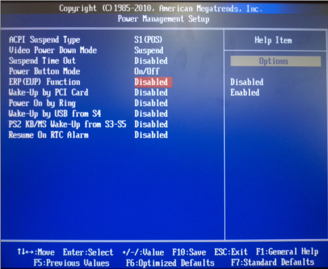
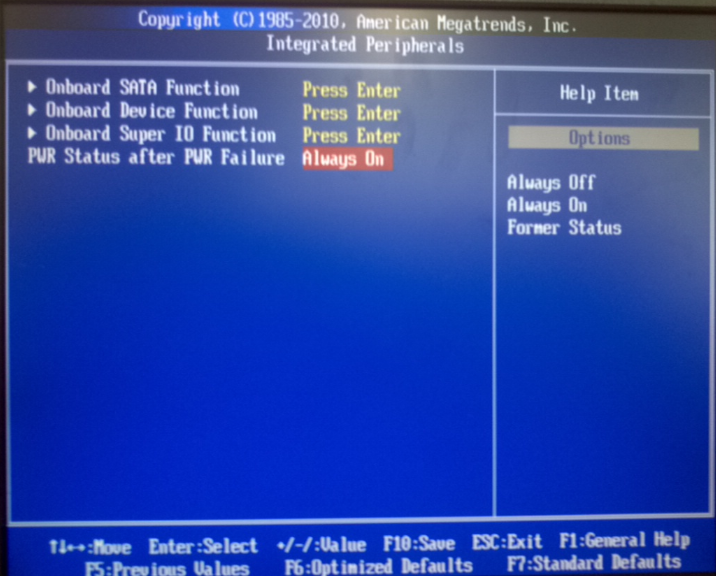

원격시스템 CMOS 설정
--------------------

자동 power on
^^^^^^^^^^^^^

본 글에서 사용하는 원격시스템의 하드웨어인 
`NF95A-270-LF
<http://www.jetway.com.tw/jw/ipcboard_view.asp?productid=721&proname=NF95A-270-LF>`_
은 꺼져있는 상태에서 전원이 공급될 경우 자동으로 켜지는 기능이 있다.
사람이 직접 접근하기 어려운 원격지에 설치된 장비에 전원이 나갔을 경우
전력이 복구된 후, 장비를 켜기 위해 사람이 투입된다면 엄청난 낭비일 것이다.
그렇기 때문에 전원만 공급되면 항상 켜지는 기능이 필요하다

.. 
    아날로그 스위치가 사용되던 시절에는 당연한 이야기 이지만, 
    요즘 사용되는 디지털 스위치는 물리적으로 켜져 있는 상태와 
    꺼져있는 상태가 구분되지 않고 꺼져있는 상태에서 누르면 
    켜지고 켜져있는 상태에서 누르면 꺼지는 식으로만 동작한다.

CMOS에서 이를 설정할 수 있다. 먼저, 
`ERP(EUP) <http://en.wikipedia.org/wiki/Energy-related_products>`_ 
Function 을 Disable 로 설정한 후 

아래 그림과 같이
PWR Status after PWR Failure 을 Always On으로 설정하면 된다.

키보드 연결 없이 부팅하기
^^^^^^^^^^^^^^^^^^^^^^^^^

NF95A-270-LF 에서는 키보드 연결을 하지 않을 경우 부팅이 되지 않는다.
이를 방지하기 위해서 아래 설정을 해 주어야 한다.

::

    CMOS > Standard CMOS Features > Halt on: All errors

위에서 ``All errors`` 부분을 ``All but keyboard`` 로 변경한다.

GRUB 설정 변경
^^^^^^^^^^^^^^
이 절은 CMOS에 관한 내용이 아니라 리눅스 부트로더인 GRUB에 대한 내용이다.
GRUB은 부팅전에 사용자에게 어떤 OS로 부팅할 것인지, 다른 작업을 할 것인지를
선택할 수 있도록 한다. ubuntu에서는 부트로더에서 사용자 입력을 받아들이기
위해 일정시간을 대기하도록 한다. 리부팅 시간을 줄이기 위해 이 대기시간을
변경하는 방법을 알아본다.

또한, GRUB에서는 시스템 실패시 ``recordfail`` 이라는 변수에 true를
기록하고 다음 부팅시 이 값이 true이면 사용자의 입력을 받아야만 
부팅이 진행되도록 하는 기능이 있다. 이 기능도 제거해야만 관리자가
편하게 모니터링 시스템을 유지할 수 있다.

이상에서 언급한 내용들은 ``/boot/grub/grub.cfg`` 의 아래 내용 부분을 찾아

4. sudo vi /boot/grub/grub.cfg

.. code-block:: sh

    if [ ${recordfail} = 1 ]; then
      set timeout=-1 ==> 1
    else
      set timeout=10
    fi

