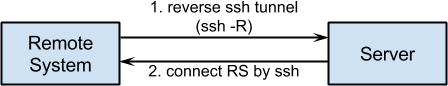
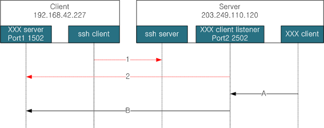

.. _remote-ssh:

서버에서 원격시스템 접근
------------------------
원격시스템들은 원격지에 분산되어 있기 때문에 시리얼 콘솔을 이용해서 
장비에 접근하는 것이 번거롭고 시간을 많이 소비하게 된다. 
때문에 원격에서 시스템에 접근할 수 있는 방법을 제공하여야만 하며 
이 경우, 디버깅과 업데이트가 용이해진다.

하지만, 원격시스템은 상용이동통신망을 이용하기 때문에 외부에서 
직접 접근이 불가능하다. 이런 경우에 접근을 할 수 있는 방법으로 
reverse ssh 터널 이 있다. 먼저 원격시스템에서 서버로 “ssh -R” 
옵션을 사용하여 역방향 터널을 만든다. 이렇게 하면, 원격시스템의 
특정 포트에서 ssh 접속을 대기하도록 설정한다. 

.. highlight:: guess

reverse ssh 터널 생성    
^^^^^^^^^^^^^^^^^^^^^
ssh는 보통 ssh 서버에 접속해 원격에서 서버를 관리할 목적으로 많이 
사용된다. 클라이언트와 서버 사이에 교환되는 패킷들을 암호화하기 때문에 
telnet보다 훨씬 안전하여 많이 사용되는 명령어이다. 하지만, ssh는 
telnet처럼 단순한 기능만을 제공하는 것은 아니다.
본 절에서는 ssh -R 옵션을 통해 remote port forwarding을 사용하는 방법을 
기술하고자 한다. 

ssh 터널을 만드는 일반적인 방법에 대해서는 아래 사이트를 참고하라.
 * http://www.hanb.co.kr/network/view.html?bi_id=547

두 host A와 B가 있을때 A는 공인IP를 가지고 있지만, B는 
사설IP만을 가지고 있다고 할 경우, 일반적으로 B에서 A로만 접근이 가능하다. 
하지만, reverse 터널을 생성할 경우 A에서 B로의 접근이 가능해 진다. 
예를 들어 설명하면, 여러분 가정에 사설IP만을 가지고 있는 리눅스 장비가 
있을 경우, 외부에서 집에 있는 리눅스로 접속하여 관리를 할 수 있다.

-R 옵션의 명령어 형태는 아래와 같다. 이 명령은 아래 그림의 client에서 수행하는 것이다.

.. code-block:: c 

    $ ssh -R <port1>:<host_of_port2>:<port2> <id@ssh_server>
    예)    $ ssh -R 2502:localhost:1502 your_id@203.249.110.120
      또는 $ ssh -R 2502:192.168.42.227:1502 your_id@203.249.110.120

위 그림과 명령어를 연관지어 설명하도록 하겠다. 

1. 먼저 client에서는 server에 ssh로 접속할 수 있어야 한다. 즉, client에서 ssh id@203.249.110.120 으로 접속이 가능해야 한다. 그림에서 화살표 1에 해당한다.

2. 접속이 가능하다면 client에서 위 예의"ssh -R 2502:localhost:1502 your_id@203.249.110.120" 명령어를 입력하여 그림에서 화살표 2에 해당하는 reverse 터널(*remote port forwarding*)을 생성한다.

3. XXX client에서 2502 포트로 접속하면, (그림에서 화살표 A에 해당)

4. reverse 터널을 통해 XXX server에 접속할 수 있다.

위의 과정을 netcat 명령어로 간단하게 검증해 보도록 하자.

1. Server에서 ssh server를 구동한다. 

#. Client에서 아래 명령을 실행한다.

.. code-block:: c 

 $ ssh -R 2502:localhost:1502 your_id@203.249.110.120
  위 명령을 수행하면 ssh로 server에 접속한 것과 증상적으로 동일한 접속이 이루어진다. 
  다른 창을 열어 아래 명령을 수행하라.

 $ nc -l -p 1502
  위 명령으로 XXX server를 port 1502에 띄워놓는다.

3. Server에서 2502 port로 접속한다. 명령 수행후 아무 글자를 쳐보면 client에 동일하게 출력되어 있는 것을 확인할 수 있다.

.. code-block:: c 

 $ nc localhost 2502

4. Server가 아닌 다른 컴퓨터에서 Sever의 2502 port로 접속하길 원한다면 아래 명령을 사용하라. 

.. code-block:: c 

 $ nc 203.249.110.120 2502  

이상에서 일반적인 용도의 reverse ssh 터널에 대해 살펴보았다. 본 글에서는
원격시스템의 제어를 위해 ssh 접속을 해야 하므로 아래 명령어를 사용하여 
터널을 연다. 포트번호 40122는 얼마든지 변경해서 사용할 수 있다.

.. code-block:: c 

 $ ssh -fN -R 40122:localhost:22 id@server_ip_or_domain_name
  -f:   백그라운드로 실행될 수 있도록 프로세스를 fork
  -N:   remote 명령어를 실행하지 않음
  -fN:  원격지에 로그인하지 않고 백그라운드로 터널만 생성

자동 ssh 로그인
^^^^^^^^^^^^^^^
윗 절에서 reverse 터널을 만드는 법을 배웠다. 시스템을 리부팅할 때마다 
터널을 만들기 위해 비밀번호를 입력하는 번거로움을 감수할 관리자는 없으리라 
생각한다. 이러한 이유로 본 절에서는 비밀번호 입력없이 ssh 서버에 자동으로 
로그인 하는 방법을 살펴본다.

host A에서 host B의 user b로 로그인하는 것을 가정하고 아래와 같은 명령을 수행하면 A에서 B로 ssh 접속을 할 때 비밀번호를 입력하지 않아도 된다.
아래는 모두 host A에서 수행할 일들이다.

1. 인증키 생성

.. code-block:: c 

    $ ssh-keygen -t rsa
      -t : 생성할 Key의 type (rsa1, dsa, ecdsa, rsa(for protocol 2))
      물어보는 내용에 대해 전부 엔터만 입력하면 된다.

2. host B에 .ssh 폴더 생성

.. code-block:: c 

    $ ssh user_b@host_B mkdir -p .ssh

3. 인증키 복사

.. code-block:: c 

    $ cat .ssh/id_rsa.pub | ssh user_b@host_B 'cat >> .ssh/authorized_keys'

.. note:: 2, 3의 과정을 한번에 수행하기

    $ ssh-copy-id user_b@host_B

.. note:: 루트권한으로 수행하는 프로세스내에서 원격지로 ssh 접속을 시도할 경우는 
    루트 계정에서 위의 작업들을 수행해 주어야 한다. 즉 host A에서 어느 계정으로 
    위의 과정을 수행하는가도 중요하다. 루트 계정에서 자동 로그인을 하기 위해서는 
    아래 명령어를 먼저 수행한 후 위 과정을 실행하라.

    $ sudo su -

연결 유지용 스크립트
^^^^^^^^^^^^^^^^^^^^
자동으로 로그인을 할 수 있으니, 이제 ssh 터널 생성 명령어를 자동화하고
연결이 끊어졌는지를 검사하여 재연결을 시도하는 
방법을 알아보자. 아래 스크립트는 인터넷에서 찾을 수 있는 
코드들인

 * http://www.brandonhutchinson.com/ssh_tunnelling.html
 * http://blog.kxr.me/2013/02/reverse-ssh-tunnel-manager-remote-ssh.html

를 약간 수정한 것이다.

.. code-block:: sh 

 #!/bin/sh

 # $REMOTE_PORT is the remote port number that will be used to tunnel
 # back to this system
 REMOTE_PORT=${PORT_PREFIX}

 # $REMOTE_HOST is the name of the remote system
 REMOTE_HOST=${YOUR_HOST_NAME}

 for PORT in "22" "80"
 do
    # $COMMAND is the command used to create the reverse ssh tunnel
    #COMMAND="autossh -f -N -R *:$REMOTE_PORT:localhost:22 $REMOTE_HOST"
    COMMAND="ssh -fN -R ${REMOTE_PORT}${PORT}:localhost:${PORT} $REMOTE_HOST"

    # Is the tunnel up? Perform two tests:

    # 1. Check for relevant process ($COMMAND)
    pgrep -f -x "$COMMAND" > /dev/null 2>&1 || $COMMAND

    # 2. Test tunnel by looking at "netstat" output on $REMOTE_HOST
    ssh $REMOTE_HOST netstat -an | egrep "tcp.*:${REMOTE_PORT}$PORT.*LISTEN" \
       > /dev/null 2>&1
    if [ $? -ne 0 ] ; then
       pkill -f -x "$COMMAND"
       $COMMAND
    fi
 done

위 코드는 원격시스템의 ssh(22)와 http(80) 포트에 접속할 수 있도록
두 개의 reverse 터널을 생성한다.
REMOTE_PORT 변수에 설정되는 값은 최종 포트번호가 아니며, for 문에 있는 22와 80과 합쳐져서 완성된 포트를 생성한다. 즉 ``${REMOTE_PORT}${PORT}`` 이 최종 포트번호이다. COMMAND 변수에 할당되는 ssh 구문을 보면 어떻게 포트가 할당되는지 이해할 수 있을 것이다.

pgrep을 이용해 명령어가 수행되고 있는지 검사하여 프로세스가 없을 경우
명령어를 수행한다. 그러므로 이 스크립트를 crontab에 등록하여 수행할 경우
cron에 의해 스크립트를 시작하기 전까지는 터널이 생성되지 않는다. 

TCP 통신에서는 단순히 터널을 설정하는 프로세스가 살아있다고 해서 
TCP 세션이 활성화 되어 있다는 것을 보장하지 않는다. 이는 telnet이나 
ssh 접속을 한 후에 오랜동안 입출력이 없으면 연결이 끊어지는 경우가 
발생하는 것으로 알 수 있다. telnet server와 telnet client는 모두 동작하고 
있지만, 연결을 끊어져 있을 수 있다는 것이다.

이를 방지하기 위해서 주기적으로 클라이언트에서 서버측으로 패킷을 보내는 
방법을 이용하며, ssh 자체적으로 해결하는 방법과 범용적인 방법이 있다. 

ssh 에서는 설정을 통해 연결유지용 패킷을 자동으로 
발생시킬 수 있다. http://www.maketecheasier.com/keep-ssh-connections-alive-in-linux 를 보면 해당 방법을 살펴볼 수 있다. 
또는, 무식한 방법이긴 하지만, 확실한 방법이기도 한
ssh 로 원격지에 접속하여 명령어를 수행하는 방법도 있다.
ssh에서는 명령어 한 줄로 이를 수행할 수 있다. 예를 들어 ``ssh user@host ls``
를 실행하면 원격지의 ls 결과를 출력한다.

범용적으로 사용할 수 있는 방법으로 
`TCP KEEPALIVE <http://tldp.org/HOWTO/TCP-Keepalive-HOWTO/index.html>`_ 
를 이용할 수 있다.  

본 절에서는 두번째로 소개한 방법을 이용하여 연결을 유지하며, 
추가적으로 연결이 실제로 유지되어 있는지를 검사하기도 한다. 일석이조라
할 수 있겠다. ㅋㅋ 명령어 ``ssh $REMOTE_HOST netstat -an | egrep "tcp.*:${REMOTE_PORT}$PORT.*LISTEN" > /dev/null 2>&1`` 은 원격지에 접속하여 netstat문으로 
reverse ssh 터널이 살아있는지를 검사하는 것이다. 이 명령어 
한 줄로 클라이언트에서 서버측으로 데이터를 보내는 효과도 있으며,
서버측에서 연결이 유효한지도 검사한다.

ssh 터널을 설정하여 서버에서 클라이언트로 접속이 가능해지면, 
어떠한 형태의 모니터링도 가능해진다. 하지만, 모니터링을 자동화 하기
위해서는 몇 가지 기술들을 더 배워야 한다. 원격시스템의 정보를 서버로
전송하기 위한 modbus 프로토콜, 로그 저장 및 전송 등이다. 
계속 읽어보시라~~
